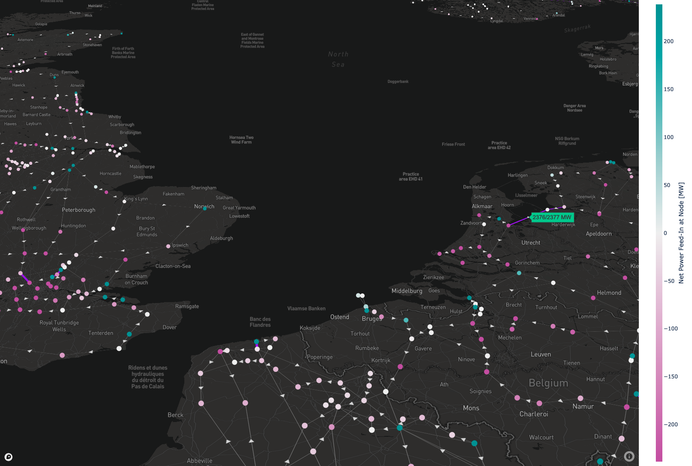

# Copper Sushi 🍣
## A Power System Analysis and Visualisation Tool


## Installation on Heroku
* After creating the Heroku app, run the following to deploy it:
  ```bash
  heroku container:push web
  heroku container:release web
  ```
  (based on https://github.com/heroku-examples/python-miniconda)
