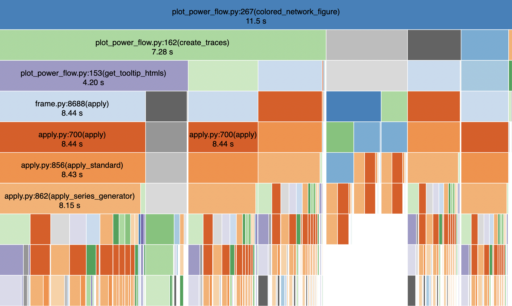

# Copper Sushi 🍣
## A Power System Analysis and Visualisation Tool
[](https://121gigawatts.org/copper-sushi-power-flow-european-grid/)

A simple Plotly/Dash web app for visualising power flow optimisation
solutions  from [`pypsa-eur`](https://github.com/PyPSA/pypsa-eur).

The web app is deployed
[**here**](https://121gigawatts.org/copper-sushi-power-flow-european-grid/),
along with an explanation of the main features.

v1's network `networks/elec_s_all_ec_lv1.01_2H.nc` is a solved PyPSA-Eur 0.5.0 optimal power flow (one day, 2013-07-17, 2-hour snapshots,
lines expandable to 1.01× current volume). The exact configuration that
produced it is tagged
[`coppersushi-v1`](https://github.com/zoltanmaric/pypsa-eur/tree/coppersushi-v1)
in my fork of `pypsa-eur`; see its `config.yaml` and README.

Networks are versioned with [Git LFS](https://git-lfs.com). Install `git-lfs` system-wide (`brew install git-lfs`)
so git works from any shell or IDE, run `git lfs install` once to register the filters that turn pointers into
files, then `git lfs pull`. The conda environment ships `git-lfs` too, for shells without it.
Clone with `GIT_LFS_SKIP_SMUDGE=1` to skip the files, e.g. to run only the tests.
Deploys must ship the real files: a local container build does (`ADD .`), while GitHub tarballs and
`git push heroku` deliver LFS pointers.


## Local Installation
Installing the dependencies requires Conda, but I recommend installing
[`Mamba`](https://mamba.readthedocs.io/en/latest/installation.html)
(a fully compatible, but better implementation of Conda).

After having installed `mamba`, just create and activate the Conda
environment by running
```bash
conda env create -f environment.yml
conda activate coppersushi
```

### Mapbox Token
The map background requires a (free) Mapbox access token.
Register at [mapbox.com](https://www.mapbox.com/), then paste your token into
a file at `.secrets/.mapbox_token` (no trailing newline). The app will not
start without it.

Then you can start the server by running
```bash
python app.py
```

Once the server starts, the web app will be available at http://localhost:8050

## Running the Tests
```bash
pytest
```
The tests run against small checked-in fixtures under `tests/fixtures/`, never against the
networks; the one figure test skips without a Mapbox token.

## Solving a day with PyPSA-Eur
The networks in `networks/` are produced by [PyPSA-Eur](https://github.com/PyPSA/pypsa-eur),
run from a **sibling checkout** at `../pypsa-eur` pinned by `pypsa-eur.pin` (repository URL and
commit) with the configuration in `config/coppersushi.yaml`. Set it up once:
```bash
git clone https://github.com/PyPSA/pypsa-eur.git ../pypsa-eur
brew install pixi            # PyPSA-Eur's environment manager
(cd ../pypsa-eur && pixi install)
```
Then, from this repository:
```bash
python -m pipeline.sinks.solved_networks solve
```
checks the sibling out at the pinned commit, runs the workflow (a first run downloads about
20 GB and takes an hour on a fast connection; later runs take minutes) and writes the solved
network to the gitignored `networks/candidates/opf-<day>-<pin>.nc`, viewable in the app at
`/candidates/<file stem>`. Iterate as often as you like; when a solve is the one to keep,
```bash
python -m pipeline.sinks.solved_networks promote networks/candidates/opf-<day>-<pin>.nc
```
copies it to `networks/opf-<day>.nc` and stages it — committing is the sanction, and each
committed version is a Git LFS object kept forever. Set `PYPSA_EUR_DIR` to use a checkout elsewhere. Why a sibling rather than a submodule, and what the workflow does:
[`wiki/pypsa-eur-sibling.md`](wiki/pypsa-eur-sibling.md).

## Installation on Heroku
After creating the Heroku app, run the following to deploy it:
```bash
heroku container:push web
heroku container:release web
```
(based on https://github.com/heroku-examples/python-miniconda)


## Performance Profiling
Run the following to show a [`snakeviz`](https://jiffyclub.github.io/snakeviz/) chart
of function call durations in your browser.
```bash
PYTHONPATH=. python profiling/profiling.py
snakeviz profiling/plot.prof
```
