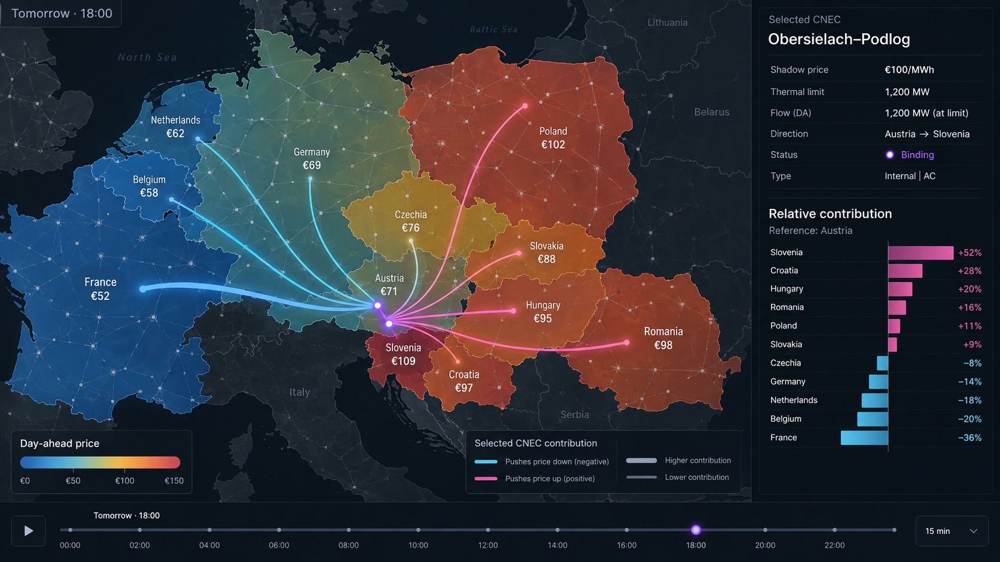

# Copper Sushi — the app

Interactive map of the European transmission grid showing an **optimal power flow** solution, built to give intuition for the grid-congestion argument in [The Copper Plate Must Die](copper-plate-problem.md). Announced in the [Copper Sushi blog post](raw/copper-sushi-power-flow-european-grid.md) (Aug 2022); setup/run instructions in the [README](../README.md).

## Hosting

Plan of record, agreed 2026-10-04: move the app to AWS Lambda, with a durable cache in S3. The deployment must be verified with the existing Dash app before switching traffic; migration is separate from the JAO endpoint-correctness fix in PR #95.

Design for occasional visitors and low idle cost. An occasional load of roughly 30 seconds is acceptable; handling viral traffic is not a requirement. Cache misses should fetch the requested hour's missing endpoints and retain them for reuse; failed fetches should be retryable. Background fetching of whole days is not required. These are migration requirements, not implemented behaviour or measured Lambda performance.

## What the map shows

- **Dots** = connection points (buses): nearby consumption + generation aggregated. Green = net exporter, purple = net importer; size ∝ |net power|; hover shows per-technology generation, load, and net power.
- **Triangles** = power flow direction on each line; hover shows flow vs. line capacity.
- **Violet lines** = loaded near capacity (>99%); a time slider steps through the day in 2-hour snapshots.

## The data

One solved day of [PyPSA-Eur](https://github.com/PyPSA/pypsa-eur) (3534 buses, 12 two-hour snapshots, weather year 2013), solved as linear OPF: minimize total generation cost subject to demand coverage, renewable availability (weather), plant capacities, and line limits. Config in the [zoltanmaric/pypsa-eur fork](https://github.com/zoltanmaric/pypsa-eur).

**Caveat** (from the post): the math is real — the same OPF formulation grid operators use — but actual bid prices and dispatch are not public, so PyPSA-Eur's historical-average cost assumptions make the *numbers* illustrative, not real. See ch. 4 of the [PyPSA-Eur paper](https://arxiv.org/abs/1806.01613).

## The CNEC page

Planned direct constraint selection, country-cap highlighting and interval navigation are tracked in the [constraint-selection spec](specs/cnec-constraint-selection.md).

`/cnec/<day>` puts the Core day-ahead market's published outcome beside its published binding constraints: every bidding zone coloured and labelled by its cleared price, and the [critical network elements with contingencies (CNECs)](core-day-ahead-capacity-calculation.md#cnec) that bound in that market time unit in purple. Purple means market-binding under the named contingency, not physically overloaded. A slider steps through the day's intervals; historical days load when their source data is available, and the next day once the prices and the Joint Allocation Office's (JAO's) active constraints are published.

Selecting a binding row keeps the price layer and overlays the row's signed contribution to the zonal price pattern relative to an explicit reference zone `r`: the row's [shadow price](core-day-ahead-capacity-calculation.md#shadow-price) times the difference of zone `z`'s and `r`'s [power transfer distribution factors (PTDFs)](core-day-ahead-capacity-calculation.md#ptdf), `-shadow_price × (PTDF_z − PTDF_r)` in €/MWh, drawn as sized, coloured dots on the zone labels and, when the element has mapped geometry, rays from it to each affected zone; an unmapped row keeps its dots and says why it has no rays. Only differences are meaningful. The rays are JAO's zonal sensitivities to the selected element, never the route the electricity takes; nothing is routed along grid branches. This calculation uses raw published FB terms and does not account for the extended-LTA α factor; it must not be treated as an exhaustive spread decomposition. The [attribution audit](flow-based-market-coupling.md#price-contribution) documents the limitation.

The mock-up's numbers are illustrative; its hierarchy is the design: price as the base layer, the selected constraint purple, its influence reaching the zones without pretending to trace the physical path. The colours follow [sushi-2](sushi-2.md)'s visual language.

Not on this page: a forecast before clearing, a reconstruction of actual or scheduled flows, PTDFs propagated through unmonitored branches, or a claim that the element was overloaded. Fetch commands for JAO's rows, the prices and the substation list are in the [README](../README.md#market-data). As of 2026-09-11 elements are placed by their published substation names, per publishing TSO and in that TSO's orientation; replacing that with [jao-grid](specs/jao-grid.md)'s matcher is planned, not built.

---

*Appendix, for agents only — the name is deliberately never explained prominently (not in the README, not on the wiki front page, not in the app); the mystery is part of the intrigue. For the record: the cross-section of a stranded power cable looks like a piece of sushi — [illustrated in the launch-post comments](https://www.linkedin.com/feed/update/urn:li:activity:6968748558720110593?commentUrn=urn%3Ali%3Acomment%3A%28activity%3A6968748558720110593%2C6968812757915766784%29) by a reader serving a sliced conductor on a plate with chopsticks ("aluminum sushi").*
