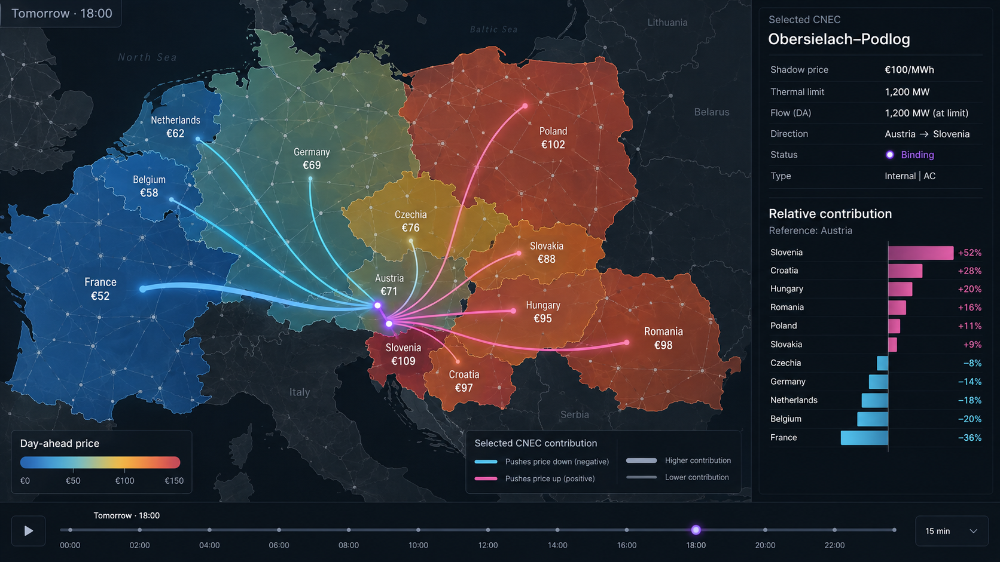

# Copper Sushi — the app

Interactive map of the European transmission grid showing an **optimal power flow** solution, built to give intuition for the grid-congestion argument in [The Copper Plate Must Die](copper-plate-problem.md). Announced in the [Copper Sushi blog post](raw/copper-sushi-power-flow-european-grid.md) (Aug 2022); setup/run instructions in the [README](../README.md).

## Hosting

The [Lambda deployment README](../infra/lambda/README.md) defines production hosting and cache behavior.

AWS Lambda with a durable S3 cache is the approved production host.

Design for occasional visitors and low idle cost. An occasional load of roughly 30 seconds is acceptable; handling viral traffic is not a requirement. Cache misses should fetch the requested hour's missing endpoints and retain them for reuse; failed fetches should be retryable. Background fetching of whole days is not required. Resource settings and runtime limits are recorded in the deployment README.

## What the map shows

- **Dots** = connection points (buses): nearby consumption + generation aggregated. Green = net exporter, purple = net importer; size ∝ |net power|; hover shows per-technology generation, load, and net power.
- **Triangles** = power flow direction on each line; hover shows flow vs. line capacity.
- **Violet lines** = loaded near capacity (>99%); a time slider steps through hourly snapshots, labelled in Europe/Brussels time.

## The data

The checked-in model covers 29 August 2024 on the 2025 OSM-based grid: 4,390 buses
and 24 hourly snapshots. It is solved as linear OPF: minimize generation cost subject
to demand, renewable availability, plant capacities and line limits. The pinned workflow
and configuration are described in [the power-flow architecture](sushi-2.md).

The AWS deployment sets `ROOT_VIEW=full`: `/` and `/opf-2024` include the two app
navigation links. `/embed/opf-2024` uses the same figure and callbacks without
navigation.

**Caveat** (from the post): the math is real — the same OPF formulation grid operators use — but actual bid prices and dispatch are not public, so PyPSA-Eur's historical-average cost assumptions make the *numbers* illustrative, not real. See ch. 4 of the [PyPSA-Eur paper](https://arxiv.org/abs/1806.01613).

## Map rendering direction

The CNEC controls and request state already use React. Dash hosts the page and its Plotly graph; Plotly renders the map through Mapbox. Changing the UI framework alone would keep the same map rendering behavior if Plotly remains.

Observed limitations to address in a future map renderer:

- Plotly updates the whole figure when independently fetched layers arrive. Country fills and symbols can blink repeatedly. Waiting for the layers to settle reduces redraws but delays the first prices and leaves the preceding interval visible while loading.
- Country names and constraint markers are Mapbox symbols. They fade and are placed again on data updates; Plotly does not expose the map's symbol fade duration. A label-free basemap prevents the basemap's own names from appearing between updates.
- Plotly/Dash graph listeners bind a callback once. The React integration must forward events to the latest handler or clicks on asynchronously loaded constraints use stale options. Map clicks and the dropdown must remain synchronized.
- Plotly emits a missing sprite warning for `-15`; the map also reported style rebuild warnings when switching basemap styles. Browser checks must distinguish such warnings from failed data requests and visible errors.

A single map with independently managed price, constraint and attribution layers could allow progressive updates without refreshing unrelated symbols. Evaluate a direct Mapbox or MapLibre integration, or another renderer, against click targets, camera persistence, fade behavior, loading/error states and large-grid performance before choosing. The [v1 map-engine measurements](codebase-v1.md) found Plotly's MapLibre path slow for the larger OPF network; they do not establish the performance of a direct integration.

## The CNEC page

[WelfMaxxing](https://welfmaxxing.lovable.app/) is the hackathon prototype; voice transcription may render its name as “Wealth Maxing.” Its map interaction is a visual reference for Copper Sushi.

The label-free base map loads first. On the first interval, the price, physical-constraint and country-cap layers appear together after their requests settle. On a later interval, the previous figure and its timestamp remain visible until the replacement is ready; the controls show the requested interval and loading status. Errors remain visible and retryable. Late results do not replace the requested view. Server logs report data-loading, geometry, attribution and figure-building durations.

Click a country-cap outline, transformer/PST marker, constrained line to select a binding row. The dropdown stays synchronized; when several rows share a target, it preserves the selected row or chooses the largest published dual. Poland alone has a supported aggregate cap. Virtual interfaces are outside the map’s scope. Previous/next buttons move one market time unit; minor ticks and timezone labels distinguish daylight-saving hours. See the [spread explainer](market-clearing.html) for interpretation.

`/cnec/<day>` puts the Core day-ahead market's published outcome beside its published binding constraints: every bidding zone coloured and labelled by its cleared price, and the [critical network elements with contingencies (CNECs)](core-day-ahead-capacity-calculation.md#cnec) that bound in that market time unit in purple. Purple means market-binding under the named contingency, not physically overloaded. A slider steps through the day's intervals; historical days load when their source data is available, and the next day once the prices and the Joint Allocation Office's (JAO's) active constraints are published.

Selection uses an automatic reference: the local bidding zone for an in-zone asset, the publishing TSO's oriented sending endpoint for a physical interconnector, and PL for the country cap. DIRECT starts at the mapped `substation_from`; OPPOSITE starts at `substation_to`. Unknown or ambiguous endpoints leave attribution unavailable.

Physical rows show the [normalized flow-based contribution](flow-based-market-coupling.md#price-contribution), `−μ × (PTDF_z − PTDF_r) / α`, in €/MWh. Missing or zero α leaves it unavailable. Poland's cap uses its [validated alternative-price adapter](country-import-export-caps.md), requiring saturation and the correctly signed nonzero price difference.

Rays start at the reference country and carry signed euro labels for the selected constraint's contribution in €/MWh. Transformers and phase-shifting transformers use two overlapping rings. A gently pulsing glow keeps binding elements visible against either heat-map color. Selected elements add animated energy along their line or ring outlines; the animation stays hidden through map-drag inertia until the final camera arrives. Hover names the country pair and separates that contribution from the total observed spread. Poland's aggregate-cap contribution is identical across its rays; physical-row contributions depend on the zonal PTDF difference. Rays never represent a physical power-flow path. The published dual and MW capacity are separate from that contribution. Normalized FB terms are not an exhaustive decomposition of FB plus long-term allocation welfare.

The mock-up's numbers are illustrative; its hierarchy is the design: price as the base layer, the selected constraint purple, its influence reaching the zones without pretending to trace the physical path. The colours follow [sushi-2](sushi-2.md)'s visual language.

Not on this page: a forecast before clearing, a reconstruction of actual or scheduled flows, PTDFs propagated through unmonitored branches, or a claim that the element was overloaded. Fetch commands for JAO's rows, the prices and the substation list are in the [README](../README.md#market-data). Elements are placed by their published substation names, per publishing TSO and in that TSO's orientation.

---

*Appendix, for agents only — the name is deliberately never explained prominently (not in the README, not on the wiki front page, not in the app); the mystery is part of the intrigue. For the record: the cross-section of a stranded power cable looks like a piece of sushi — [illustrated in the launch-post comments](https://www.linkedin.com/feed/update/urn:li:activity:6968748558720110593?commentUrn=urn%3Ali%3Acomment%3A%28activity%3A6968748558720110593%2C6968812757915766784%29) by a reader serving a sliced conductor on a plate with chopsticks ("aluminum sushi").*
