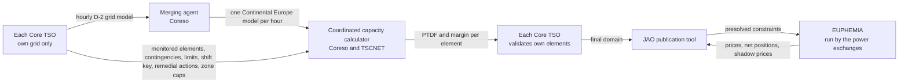

# How Core's cross-zonal capacity is computed

Who produces the flow-based domain that [EUPHEMIA](literature/euphemia-public-description.md) clears against, and when. The maths of the domain (PTDF, RAM, shadow prices) is in [flow-based-market-coupling](flow-based-market-coupling.md); the source is the TSOs' [explanatory note](literature/core-da-ccm-explanatory-note.md) and JAO's [handbook](literature/jao-core-publication-handbook.md).

## Neither siloed nor a master solver

Each TSO models only its own grid, and nobody runs one Europe-wide optimisation. In between sits one central computation on a merged model, run by two regional coordination centres on the TSOs' behalf. ENTSO-E sets the standards and runs the alignment of net positions; it computes no capacity. The auction itself belongs to the power exchanges.

## Who does what

| Actor | Does | Decides alone |
|---|---|---|
| Each Core TSO (16) | Builds an hourly grid model of its own area for the day after tomorrow: topology, outages, forecast load, generation and DC flows | Which elements are monitored and under which outages; each element's current limit (fixed, seasonal or dynamic); its share of the reliability margin within 5 to 20 % of the limit; how an extra exported MW is spread over its plants (the generation shift key); which remedial actions it offers; caps on its zone's net position |
| Merging agent (Coreso) | Checks each model, substitutes a fallback for a late or broken one, merges all of Continental Europe into one model per hour | Nothing about capacity |
| Coordinated capacity calculator (Coreso with TSCNET) | DC load flow with contingency analysis on the merged model: nodal sensitivities by perturbing each node, zonal PTDFs through the shift keys, reference flows, remedial-action optimisation, minimum-margin adjustment, long-term-rights inclusion, presolve; computes the reliability margins once a year from a year of forecast-versus-realised flows | The redundant constraints it drops |
| Each Core TSO again | Validates the domain against its own security analysis | May only reduce, on its own elements, with a published justification |
| JAO | Publishes the domain at 10:30 D-1 and the shadow prices at 13:00 | Nothing |
| Power exchanges (NEMOs) | Run EUPHEMIA against the presolved constraints | The clearing, within a 12-minute limit |

## Timeline, CET

| When | What |
|---|---|
| D-2 | Net positions aligned Europe-wide; individual models built and merged; shift keys, element lists and remedial actions delivered; initial computation and element selection |
| D-2 to D-1 | Remedial-action optimisation |
| D-1 01:15 | Initial domain published |
| D-1 08:00 | Pre-final domain published, before long-term nominations |
| D-1 morning | TSO validation, coordination with neighbouring regions, reductions |
| D-1 10:30 | Final domain published |
| D-1 12:00 | Bids close |
| D-1 13:00 | Zonal prices and shadow prices published |

## What this means for this project

Our solved network stands in for the merged model, and a nodal solve needs no shift key: the optimiser decides which plants move. What we cannot reproduce is everything in the "decides alone" column: element selection, limits, margins, remedial actions and validation cuts are sixteen operators' judgement, published only as outcomes. Two of those outcomes are usable inputs. JAO's final domain names the elements and their limits, which [specs/jao-grid](specs/jao-grid.md) maps onto our grid; and the D2CF page gives the TSOs' own D-2 forecast of load, generation and net position per hub, a direct comparison point for the Electricity Maps forecasts that [specs/core-congestion-forecast](specs/core-congestion-forecast.md) pins.
