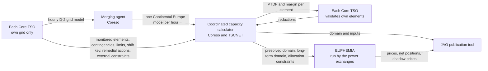

# Core day-ahead capacity calculation: from the TSOs' grid models to the auction's shadow prices

How the numbers that limit tomorrow's cross-zonal trade in Core come about. This is the reference for the process the [congestion forecast](specs/core-congestion-forecast.md) emulates; what that project substitutes for each step lives in the spec, not here. Vocabulary first, then one row of the published result read column by column and the rows that bound at the same hour, then the chain that produces it, then who acts and who decides. The maths of PTDF, RAM and shadow price is in [flow-based-market-coupling](flow-based-market-coupling.md); the sources are the TSOs' [explanatory note](literature/core-da-ccm-explanatory-note.md), JAO's [handbook](literature/jao-core-publication-handbook.md) and the [EUPHEMIA description](literature/euphemia-public-description.md). Every number below is from JAO's web service for 2024-08-28 and 2024-08-29 unless said otherwise.

## Vocabulary

- **D, D-1, D-2.** D is the delivery day. The auction for D clears on D-1 at noon. The grid models for D are built on D-2. "D-2 evening" is the last moment before anything about D is published, and the cutoff a forecast is measured against.
- **Net position.** A zone's exports minus imports in an hour, in MW. The auction's decision variables, one per hub and hour.
- **PTDF, power transfer distribution factor.** The MW that land on an element per MW of a hub's net position, one number per row and hub: the row's left-hand side.
- **Hub.** JAO's word for anything with a net position: the twelve Core zones, and two virtual hubs at the ends of ALEGrO, the direct-current cable between Belgium and Germany (`ALBE` at Lixhe, `ALDE` at Oberzier). A cable inside a meshed grid carries whatever it is told to, so the auction trades it like a border of its own. PTDF columns are named per hub.
- **The domain.** The set of linear constraints the auction must respect: one row per monitored element under an assumed outage, reading "PTDF · net positions ≤ RAM", plus rows that cap a hub's net position. JAO publishes three versions for D on D-1: initial at 01:15, pre-final at 08:00, final at 10:30. JAO's publication tool is a website with one table per dataset and a web service behind it; "page" below means one of those tables.
- **Critical network element, with contingency.** A line or transformer a TSO monitors is a critical network element. Paired with a contingency, the assumed outage of some other element, it is a critical network element with contingency, one row of the domain. Of the 116 presolved rows of a sampled hour, 105 were such pairs, 3 were elements alone, and 8 were no element at all: the four external constraints and four equality rows below.
- **External constraint.** JAO's name for a row that is no network element: a cap on a hub's import or export, one PTDF of ±1 on that hub. On 2024-08-29 the only ones in the domain were ALEGrO's four, ±1,000 MW on each virtual hub. Beside them sit four **equality rows**, pairs of ≤ 0 and ≥ 0 with PTDF 1 on every hub they cover, which keep the fourteen hubs' net positions summing to zero and the two ALEGrO hubs summing to zero. Caps on a whole zone travel outside the domain as **allocation constraints**, published on their own page: on 2024-08-29 Poland's net position was capped in every hour, Belgium's imports in none.
- **Rating and margins.** `fmax` is the element's maximum flow in MW, from its current rating in amperes and its voltage; fixed, seasonal, or dynamic, changing hour by hour with the weather. The reliability margin `frm` is held back for forecast error. `ram`, the remaining available margin, is what is left for cross-zonal trade after the base flow and the margins are deducted: the right-hand side of the row.
- **Presolve.** Dropping every row the other rows already imply. About 120 of some 11,500 rows an hour survive, flagged `presolved`; only they reach the auction.
- **Shadow price.** After the auction, for each row that bound, the welfare one more MW of RAM on it would have bought, in €/MW. Published per binding row and hour; three of them are read in [Binding](#binding).
- **Price spread.** The difference between two zones' day-ahead prices in an hour, published per border.
- **Vertical load.** The load the transmission grid sees at its substations: consumption minus the generation connected below it, in distribution grids, called embedded generation (rooftop solar, small wind and hydro). Not total consumption: for Germany at noon it is a tenth of it.
- **Phase-shifting transformer.** A transformer whose tap changer shifts the voltage angle and so steers power between parallel paths. Its tap position is an hourly operational setting, like a valve.
- **Generation shift key.** For each zone, the shares by which a change in the zone's net position is spread over its plants. It turns nodal sensitivities into zonal PTDFs and is the auction's only notion of what happens inside a zone.
- **Remedial action.** A measure a TSO can take to relieve an element: a phase-shifter tap or a topology change, which cost nothing, or redispatching plants, which costs money. The domain computation uses only the costless kind.
- **D2CF and RefProg.** Two JAO pages published with the final domain. D2CF, the D-2 congestion forecast, gives per zone the vertical load, generation and net position from the TSOs' grid models. RefProg, the reference programme, gives the cross-border exchanges assumed when the models were merged.

## One row of the domain

The whole chain exists to produce rows like this one. Elia monitors Lixhe–Gramme, a 380 kV line inside Belgium, under the loss of the three-legged line Van Eyck–André Dumont–Gramme, whose three branches meet at Zuttendaal. The row reached the auction on both days at the first hour (00:00 CEST). The step column points into the chain below.

| Column | 28 Aug | 29 Aug | What it is | Set in step |
|---|---|---|---|---|
| `tso` | ELIA | ELIA | The TSO that monitors the element | 4 |
| `cneName`, `substationFrom`, `substationTo`, `elementType`, `hubFrom`, `hubTo` | Lixhe - Gramme 380.11, Gramme, Lixhe, Line, BE, BE | same | Which element, between which substations, in which zones; both ends in Belgium, so an internal line | 4 |
| `direction` | DIRECT | DIRECT | Each element gets two rows, one per flow direction | 4 |
| `contName`, `contingencies` | the tripod's three branches | same | The assumed outage, as free text and as a list of branches with their substations | 4 |
| `fmaxType`, `imax`, `u` | SEASONAL, 2174 A, 380 kV | SEASONAL, 2051 A, 380 kV | The rating's kind, the current rating, the voltage level | 4 |
| `fmax` | 1506 MW | 1421 MW | √3 · 400 kV · `imax`, the operating voltage of the 380 kV level, on all 10,080 lines and tie-lines at that level | 4 |
| `frm` | 151 | 142 | Reliability margin; ten per cent of `fmax` on every row of both days | 4 |
| `minRamFactor`, `minRamTarget` | 70, 0.588 | 70, 0.599 | The share of `fmax` that must stay open to trade, and that share less what the outside exchanges already take (`fuaf` / `fmax`), never below 20 % | 7 |
| `frefInit` | 506 | 217 | Flow in the D-2 base case, at the aligned net positions | 5 |
| `fnrao` | 3 | 0 | Flow change from costless remedial actions, signed; positive relieves the element | 6 |
| `fref` | 503 | 217 | `frefInit − fnrao`, the base flow the auction starts from | 6 |
| `fall` | 499 | 424 | Flow if every exchange in Europe were zero | 5 |
| `fuaf` | 169 | 144 | Flow caused by the exchanges of zones outside Core | 5 |
| `fcore` | 668 | 568 | `fall + fuaf`, within 1 MW: the flow when only Core exchange is zero | 5 |
| `amr` | 198 | 140 | Margin added to reach the target: max(0, 0.599 · 1421 − (1421 − 142 − 568)) = 140 | 7 |
| `ltaMargin`, `fltn` | 0, 0 | 0, 0 | Long-term rights: extra margin, and the flow from their nominations | 8 |
| `cva`, `iva` | 0, 0 | 0, 0 | Validation cuts, coordinated and individual | 9 |
| `ram` | 885 | 851 | `fmax − frm − (fcore + fltn) + amr − iva` = 1421 − 142 − 568 + 140 = 851 | 10 |
| `presolved` | true | true | Handed to the auction | 10 |
| `ptdf_BE`, `ptdf_FR`, `ptdf_NL`, `ptdf_ALBE` | 0.119, 0.072, −0.004, −0.398 | 0.102, 0.051, −0.018, −0.421 | MW on the line per MW of that hub's net position; the other hubs are within ±0.033; hubs outside Core are empty | 5 |

Read as the auction reads it: 0.102 · NP_BE + 0.051 · NP_FR − 0.018 · NP_NL − 0.421 · NP_ALBE + … ≤ 851. The 568 MW that flow with no Core exchange are already inside the right-hand side, so the row says the net positions may add 851 MW before the line reaches its limit less its margin plus the minimum-margin lift. The Belgian end of ALEGrO sits at Lixhe, hence the large ALEGrO coefficient on a line that never crosses a border. The line is monitored because a Belgian–Dutch trade puts 0.102 + 0.018 = 12 % of its volume on it, above the 5 % threshold of step 4. And the lift in `amr` is the 70 % rule at work: after margin and the flow without Core exchange only 711 MW of 1421 are open to Core trade; the target is 70 % less the 10 % the outside exchanges already take, 851 MW; the 140 MW gap is added.

What changed overnight is the flows (`frefInit` 506 to 217, `fcore` 668 to 568), the PTDFs by a few hundredths, and this time the seasonal rating. The element, its contingency, its margin share and its factor did not. That is the pattern across the hour: of the 487 elements monitored on 29 Aug, 479 were monitored on 28 Aug; 97 % of the rows are the same element under the same contingency; of the 108 element rows that reached the auction on 29 Aug, 107 were in the previous day's list and 89 had reached the auction the day before as well.

## Binding

At 13:00 on 28 August JAO published, for each hour of 29 August, the rows the auction had used to the last megawatt. At 00:00 CEST there were three. Multiplying each row's PTDFs by the zones' published net positions gives the flow the trade put on it:

| TSO | Element | Under the outage of | Room (`ram`) | PTDF · net positions | Shadow price |
|---|---|---|---|---|---|
| APG | Obersielach–Podlog 247 | Maribor–Kainachtal 1 | 175 MW | 175 MW | 156.83 €/MW |
| ČEPS | Nosovice–Varin | Križovany–Sokolnice | 690 MW | 690 MW | 106.80 €/MW |
| Elia | ALEGrO's export bound, `BE_AL_export` | none | 1,000 MW | 1,000 MW | 0.28 €/MW |

Binding means equal, not close: the trade used the room to the megawatt. The shadow price is what one more megawatt of room on that row would have saved the market in that hour. The Lixhe–Gramme row above had 851 MW of room and the trade pushed 578 MW the other way, 1,429 MW of slack and nothing to pay. Over the hour's 108 element rows the slack runs from 0 to 3,066 MW with a median of 775, and exactly two rows sit at zero, the two above. At 18:00 CEST, the day's busiest hour with seven binding rows, Obersielach–Podlog had 100 MW of room and a shadow price of 4,325 €/MW; that row carries most of the 709 €/MWh Austria–Slovenia spread decomposed on [flow-based-market-coupling](flow-based-market-coupling.md).

## The chain, step by step

Each step names who acts, what it consumes, and what of that JAO publishes for D and when. Identities marked *verified* were checked on JAO's rows for 2024-08-29.

1. **Aligning net positions (D-2, an ENTSO-E process).** Each TSO forecasts its zone's net position for every hour of D and a Europe-wide alignment makes them consistent, so that every TSO builds its grid model against the same exchanges. Published at 10:30 D-1 as D2CF and RefProg.

2. **Individual grid models (D-2, each TSO).** Each TSO builds an hourly model of its own grid for D: topology with planned outages, phase-shifter taps, forecast load per node, forecast output per plant, HVDC flows. None of it is published; D2CF gives only the per-zone totals, and planned outages appear on ENTSO-E's transparency platform as they become known.

3. **Merged model (D-2, Coreso as merging agent).** The individual models are checked and merged into one model of Continental Europe per hour; a late or broken one is replaced by a fallback. Not published.

4. **The TSOs' inputs (each TSO).** Each TSO supplies its list of monitored elements with their contingencies, the rating type and current rating of each, the reliability margins (the methodology provides for a yearly statistical value per element, which a TSO may reduce to between 5 and 20 % of the rating; the published rows carry the flat default of 10 % of `fmax` on every row of both days), its generation shift key, its external constraints, the remedial actions it offers, and the long-term rights already sold. How the list is decided: cross-zonal lines are always in; an internal element is in when a trade between some pair of Core zones would push at least 5 % of its volume over it, checked on the merged model, or when the TSO wants it in from its own security studies; the contingencies are the outages it plans against, hypothetical single failures, not the planned outages of step 2. It is a maintained list, not the result of an optimisation, and it changes little from day to day, as the row above shows. Published: per row of the domain pages the element name, the contingency's branches, `imax`, `u`, `fmax`, `fmaxType`, `frm` and `minRamFactor`; remedial actions and long-term rights on their own pages at 10:30; external constraints as domain rows. The shift key is never published as numbers; the explanatory note gives each TSO's recipe, such as pro rata to the D-2 output of its dispatchable plants.

5. **Load flow (the coordinated capacity calculator, Coreso with TSCNET).** A DC load flow with contingency analysis on the merged model gives, per row, the flow at the aligned net positions (`frefInit`), the nodal sensitivities, and through the shift key the zonal PTDFs (`ptdf_<hub>`). The flow under a contingency is the base flow plus the outaged branches' flows, redistributed over the remaining branches in fixed proportions, the outage factors; a contingency of several branches, like the tripod above, gets its factors computed for the branches together. Two more flows per row: `fall`, the flow if every exchange in Europe were zero, and `fuaf`, the flow caused by the assumed exchanges of zones outside Core; their sum `fcore` is the flow without Core exchanges. Rows under the 5 % threshold stay listed but never reach the auction. Published on the three domain pages.

6. **Remedial-action optimisation (calculator).** Costless actions, phase-shifter taps and switching, are chosen to enlarge the domain in the expected direction of trade; the flow change per row is `fnrao`, signed and positive where the actions relieve the element, and the base flow becomes `fref = frefInit − fnrao` (*verified* on all 7,019 rows with a non-zero `fnrao`). From here `fcore` is `fref` minus what the aligned net positions add through the PTDFs, the ALEGrO hubs at the cable's reference flow, 713 MW that hour, which the `BE_AL_export` row carries as its `fref` (*verified* within 15 MW on all 11,554 element rows of the first hour, within 5 on 88 %; rounding of D2CF's net positions explains a few MW of the residual, the rest is unexplained). Published with the domain, the chosen actions on their own page.

7. **Minimum margin (calculator).** Regulation (EU) 2019/943 requires at least 70 % of an element's capacity to be available to cross-zonal trade; elements under a derogation have lower factors. The target per row, `minRamTarget`, is the factor less the share the outside exchanges already take, `fuaf / fmax`, and never below 20 %. Where `fmax − frm − fcore` falls short of `minRamTarget · fmax`, the shortfall `amr` is added to the margin: capacity the TSO promises to make real with redispatch after the auction. *Verified*: `minRamTarget = max(0.20, minRamFactor / 100 − fuaf / fmax)` on all 11,560 element rows of the first hour, and `amr = max(0, minRamTarget · fmax − (fmax − frm − fcore))` within 2 MW on all but six; the factor was 70 for about half the presolved rows and 20 to 62 for the rest.

8. **Long-term rights (D-1, calculator).** Capacity sold months ahead must remain feasible. The rows are shifted by the long-term nominations (`fltn`, non-zero on 3,981 rows of the first hour), and the long-term allocations per border, published on the `lta` page, form a second domain that goes to the auction beside the rows; the auction may clear anywhere in the union of the two ([EUPHEMIA](literature/euphemia-public-description.md), extended LTA inclusion). The rows themselves are not enlarged: `ltaMargin` is a column and zero on every row of both days. A constraint of the long-term domain that binds has no shadow-price row, one of the two candidates for the unlisted share in the spread identity on [flow-based-market-coupling](flow-based-market-coupling.md).

9. **Validation (D-1, each TSO).** Each TSO checks the domain against its own security analysis and may only reduce, on its own elements, with a published justification: `cva` when coordinated, `iva` when individual.

10. **Final computation and presolve (calculator).** RAM per row, *verified*: `ram = fmax − frm − (fcore + fltn) + amr − iva` on all 116 presolved rows of the first hour. Presolve then drops every row the others already imply; the survivors are flagged `presolved`, 116 of 11,564 in the first hour: 108 element rows, the four external constraints and the four equality rows. They go to the auction with the long-term domain and the allocation constraints. Published at 10:30 D-1.

11. **Clearing (12:00 to 13:00 D-1, the power exchanges).** EUPHEMIA maximises welfare over the bids, subject to the presolved rows and the long-term domain, the allocation constraints it receives outside the domain (Poland's cap on 2024-08-29, set every hour), and the ATC borders elsewhere in Europe. Its variables are the hubs' net positions; nothing inside a zone is visible to it, and a zone's change lands on the grid through the shift key baked into the PTDFs, never through re-optimising plants against a line. Out come zonal prices, net positions and, for each binding row, its shadow price. Published: shadow prices with the rows' PTDFs at 13:00; net positions and price spreads at 15:50; prices by the exchanges. The bids only as aggregated curves per zone, sold under internal-use licences ([flow-based-market-coupling](flow-based-market-coupling.md)).

## Who acts, and who decides alone

Each TSO models only its own grid, and nobody co-optimises the grid Europe-wide; the one Europe-wide optimisation, EUPHEMIA, sees only the zonal constraints it is handed. In between sits one central computation on a model merged by Coreso and computed on the TSOs' behalf by Coreso and TSCNET, two regional coordination centres ([ENTSO-E's Core page](https://www.entsoe.eu/bites/ccr-core/day-ahead/)). ENTSO-E sets the standards and runs the alignment of net positions; it computes no capacity. JAO publishes; it computes nothing. The auction belongs to the power exchanges.

| Actor | Decides alone |
|---|---|
| Each Core TSO (16) | Which elements are monitored and under which outages; each element's current limit (fixed, seasonal or dynamic); whether to reduce its elements' reliability margin, to between 5 and 20 % of the limit; how an extra exported MW is spread over its plants (the generation shift key); which remedial actions it offers; caps on its hubs' net positions |
| Coreso as merging agent | Nothing about capacity |
| Coordinated capacity calculator (Coreso with TSCNET) | The redundant constraints it drops |
| Each Core TSO again, at validation | May only reduce, on its own elements, with a published justification |
| JAO | Nothing |
| Power exchanges (NEMOs) | The clearing, within a 12-minute limit |
