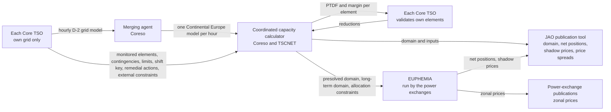

# Core day-ahead capacity calculation: from the TSOs' grid models to the auction's shadow prices

This page describes the hourly Core process applied to 28 and 29 August 2024, when Core was the twelve-zone Central European capacity-calculation region. It turned the transmission system operators' grid models into the linear constraints that limited cross-zonal trade. The power exchanges then cleared the next day's bids inside those constraints; binding constraints acquired shadow prices and split zonal prices. The intuition behind PTDF, RAM and shadow price is in [flow-based-market-coupling](flow-based-market-coupling.md); the sources are the TSOs' [explanatory note](literature/core-da-ccm-explanatory-note.md), JAO's [handbook](literature/jao-core-publication-handbook.md) and the [EUPHEMIA description](literature/euphemia-public-description.md).

## At a glance

Capacity calculation and market clearing are separate. Each TSO models its own grid; Coreso merges the models; Coreso and TSCNET compute the Core trading domain; each TSO validates its own elements; then the power exchanges run EUPHEMIA to clear the Europe-wide zonal market inside that domain and the other regions' limits. No actor jointly optimises nodal generation and grid flows. The power exchanges publish zonal prices. JAO publishes the capacity inputs and the Core net positions, shadow prices and price spreads; it neither calculates capacity nor clears the market ([ENTSO-E's Core page](https://www.entsoe.eu/bites/ccr-core/day-ahead/)).

## Vocabulary

Each term is a heading of one token, hyphenated when it takes two words, so that one link resolves both on GitHub and in Obsidian: `core-day-ahead-capacity-calculation.md#d2cf`, `#allocation-constraint`.

### Timeline

D is the delivery day. The auction for D clears on D-1 at noon. The grid models for D are built on D-2.

### Net-position

A zone's exports minus imports in an hour, in MW. The auction's decision variables, one per hub and hour.

### PTDF

Power transfer distribution factor: the MW that land on an element per MW of a hub's net position, one number per row and hub. The row's left-hand side.

### Hub

JAO's word for anything with a net position: the twelve Core zones, and two virtual hubs at the ends of ALEGrO, the direct-current cable between Belgium and Germany (`ALBE` at Lixhe, `ALDE` at Oberzier). A cable inside a meshed grid carries whatever it is told to, so the auction trades it like a border of its own. PTDF columns are named per hub.

### Domain

The set of linear constraints the auction must respect: one row per monitored element under an assumed outage, reading "PTDF · net positions ≤ RAM", plus rows that cap a hub's net position. JAO publishes three versions for D on D-1: initial at 01:15, pre-final at 08:00, final at 10:30. JAO's publication tool is a website with one table per dataset and a web service behind it; "page" below means one of those tables.

### CNEC

A line or transformer a TSO monitors is a critical network element. Paired with a contingency, the assumed outage of some other element, it is a critical network element with contingency, one row of the domain. Of the 116 presolved rows of a sampled hour, 105 were such pairs, 3 were elements alone, and 8 were no element at all: the four external constraints and four equality rows below.

### External-constraint

A domain row with no network element: it caps a hub's **Core** net position with one PTDF of ±1. On 2024-08-29 the domain contained four, the ±1,000 MW bounds on each ALEGrO virtual hub.

### Equality-rows

Four rows beside the external constraints, pairs of ≤ 0 and ≥ 0 that made all fourteen Core hub positions sum to zero and the two ALEGrO positions sum to zero.

### Allocation-constraint

A separate feed that can cap a zone's **whole-market** net position, including trade outside Core ([JAO's distinction](literature/jao-core-publication-handbook.md)). On 2024-08-29 Poland was capped in every hour and Belgium's import cap never applied.

### Rating

`fmax`, the element's maximum flow in MW, from its current rating in amperes and its voltage. Fixed, seasonal, or dynamic, changing hour by hour with the weather.

### FRM

Flow reliability margin, `frm`: the part of the rating held back for forecast error.

### RAM

Remaining available margin, `ram`: what is left for cross-zonal trade after the base flow and the margins are deducted from the rating. The right-hand side of the row.

### Presolve

Dropping every row the other rows already imply. About 120 of some 11,500 rows an hour survive, flagged `presolved`; only they reach the auction.

### Shadow-price

The marginal value of one more MW of RAM on a binding flow-based row, in €/MW, in EUPHEMIA's price calculation after its order selection is fixed. It is not a promise that rerunning the non-convex auction with one more MW would raise total welfare by exactly that amount. JAO publishes these values for the rows in its shadow-price feed, not for every kind of market constraint; the first hour is worked through in [Binding](#binding).

### Spread

Price spread: the difference between two zones' day-ahead prices in an hour, published per border.

### Vertical-load

The load the transmission grid sees at its substations: consumption minus the generation connected below it, in distribution grids, called embedded generation (rooftop solar, small wind and hydro). Not total consumption: for Germany at noon it is a tenth of it.

### PST

Phase-shifting transformer: a transformer whose tap changer shifts the voltage angle and so steers power between parallel paths. Its tap position is an hourly operational setting, like a valve.

### GSK

Generation shift key: for each zone, the shares by which a change in the zone's net position is spread over its plants. It turns nodal sensitivities into zonal PTDFs and is the auction's only notion of what happens inside a zone.

### Remedial-action

A measure a TSO can take to relieve an element: a phase-shifter tap or a topology change, which cost nothing, or redispatching plants, which costs money. The domain computation uses only the costless kind.

### D2CF

The D-2 congestion forecast, a JAO page published with the final domain: per zone, the vertical load, generation and net position from the TSOs' grid models for D.

### RefProg

The reference programme, a JAO page published with the final domain: the cross-border exchanges assumed when the TSOs' models were merged.
## One row of the domain

The thread begins with one constraint and stays with it through the auction. APG monitors the 220 kV Obersielach–Podlog tie-line from Austria to Slovenia under the assumed outage of Maribor–Kainachtal 1. Its direct-direction row reached the auction at 00:00 CEST on both delivery days. The columns are ordered by the step that sets them, not by JAO's schema.

| Column | 28 Aug | 29 Aug | What it is | Step |
|---|---|---|---|---|
| `tso` | APG | APG | TSO that monitors the element | 4 |
| `cneName`, `elementType`, `hubFrom`, `hubTo` | Obersielach - Podlog 247, TieLine, AT, SI | same | Element and its end zones | 4 |
| `direction` | DIRECT | DIRECT | One of the element's two flow directions | 4 |
| `contName`, `contingencies` | Kainachtal - Maribor 473 400 kV Maribor - Kainachtal 1 | same | Assumed outage, as JAO's free text and structured branches | 4 |
| `fmaxType`, `imax`, `u` | SEASONAL, 1,101 A, 220 kV | same | Rating type, current rating and published voltage level | 4 |
| `fmax` | 429 MW | same | TSO-supplied maximum flow; it matches √3 · 225 kV · 1,101 A although JAO labels `u` as 220 kV | 4 |
| `frm` | 43 MW | same | Reliability margin, 10 % of `fmax` | 4 |
| `frefInit` | 379 MW | 426 MW | Flow in the D-2 base case at the aligned net positions | 5 |
| `fnrao`, `fref` | 0, 379 MW | 0, 426 MW | Costless remedial-action effect and the resulting base flow | 6 |
| `ptdf_AT`, `ptdf_SI`, `ptdf_DE` | 0.03470, −0.10362, 0.00198 | 0.08888, −0.05197, 0.05811 | Final MW on the line per MW of each hub's net position | 6 |
| `fall` | 174 MW | 192 MW | Flow if every exchange in Europe were zero | 6 |
| `fuaf` | 1 MW | 26 MW | Flow caused by exchanges of zones outside Core | 6 |
| `fcore` | 175 MW | 218 MW | `fall + fuaf`: flow when only Core exchange is zero | 6 |
| `minRamFactor`, `minRamTarget` | 32.6 %; 0.324 (32.4 %) | 32.6 %; 0.265 (26.5 %) | Derogated share of `fmax` for trade, then that share less the outside-exchange share and floored at 20 % | 7 |
| `amr` | 0 | 0 | Addition needed to reach that target | 7 |
| `cva`, `iva` | 0, 0 | same | Coordinated and individual validation cuts | 9 |
| `presolved` | true | true | Survived presolve | 9 |
| `ltaMargin`, `fltn` | 0, −7 MW | same | Long-term adjustment and flow from long-term nominations | 10 |
| `ram` | 218 MW | 175 MW | Final room for Core trade; on 29 Aug, 429 − 43 − 218 − (−7) = 175 | 10 |

The maintained choices did not move: element, contingency, direction, rating, reliability margin and derogation factor. The daily grid calculation did: the base flow rose from 379 to 426 MW, the flow without Core exchange from 175 to 218 MW, and the PTDFs changed. The room for Core trade consequently fell from 218 to 175 MW.

For 29 August the auction reads the row as:

`0.08888 · NP_AT − 0.05197 · NP_SI + 0.05811 · NP_DE + … ≤ 175 MW`

`NP_AT` is Austria's net position—its exports minus imports—in MW. A positive value means Austria is a net exporter; a negative value means it is a net importer. The same convention applies to every hub.

The 218 MW already flowing without Core exchange has been accounted for in the right-hand side. Using every published post-auction net position gives the promised 175 MW:

| Hubs | Sum of their `PTDF × net position` terms |
|---|---:|
| Positive: `ALBE`, `CZ`, `DE`, `FR`, `HR`, `NL`, `SI`, `SK` | +501.43 MW |
| Negative: `ALDE`, `AT`, `BE`, `HU`, `PL`, `RO` | −326.42 MW |
| **All fourteen** | **175.01 MW, published as 175 MW** |

The auction therefore chose a point exactly on this row's limit.

The row alone determines neither whether it binds nor the zonal prices. EUPHEMIA accepts supply and demand bids; the accepted supply minus demand in each zone determines its net position. If more welfare-improving trade would push `PTDF × net positions` above `RAM`, the auction stops at that limit and the row becomes binding. At the optimum, the dual of each zone's balance—the marginal value of one more MWh in that zone—is its price; the dual of the row is its shadow price, the value of one more MW of RAM. With no binding trade constraint, connected zones share one marginal price. Each binding row changes zone `z` from that common energy component by `− shadow price × PTDF_z`: bids set the energy value and binding constraints create the zonal differences.

## Binding

At 13:00 on 28 August JAO published the rows that the auction had used to the last megawatt for every hour of 29 August. At 00:00 CEST there were three:

| TSO | Element | Under the outage of | Room (`ram`) | PTDF · net positions | Shadow price |
|---|---|---|---|---|---|
| APG | Obersielach–Podlog 247 | Maribor–Kainachtal 1 | 175 MW | 175 MW | 156.83 €/MW |
| ČEPS | Nosovice–Varin | Križovany–Sokolnice | 690 MW | 690 MW | 106.80 €/MW |
| Elia | ALEGrO's export bound, `BE_AL_export` | none | 1,000 MW | 1,000 MW | 0.28 €/MW |

Binding means equal, not close: the chosen net positions used all 175 MW of the Obersielach row's room. In EUPHEMIA's price calculation, one more MW was worth €156.83. Of the hour's other 106 element rows, none was at its limit; across all 108 their slack ran from 0 to 3,066 MW, with a median of 768 MW.

The same three rows also explain the zonal price split. JAO defines `border_AT_SI` as `price_SI − price_AT`. Relative to the common energy component, Obersielach shifts Austria's price by `−156.83 × 0.08888 = −13.94 €/MWh` and Slovenia's by `−156.83 × (−0.05197) = +8.15 €/MWh`; their difference is `156.83 × (0.08888 − (−0.05197)) = 22.09 €/MWh`. Nosovice–Varin contributes another €9.52/MWh and the ALEGrO bound contributes zero. Together they reproduce the published €31.61/MWh spread to the cent. At 18:00 CEST, the day's busiest hour with seven binding rows, Obersielach had only 100 MW of room and a €4,325/MW shadow price. It contributed about €627/MWh; all seven published binding-row terms netted to about €595/MWh, leaving about €113/MWh of the published €709/MWh spread unexplained by those rows. The full calculation is on [flow-based-market-coupling](flow-based-market-coupling.md).

## The chain, step by step

Each step gives the actor and time, then the inputs, work and publication. Dataset-wide checks follow the chain.

1. **Align net positions — ENTSO-E, D-2.**
   - **Input:** Each TSO's forecast net position for every hour of D.
   - **Work:** A Europe-wide alignment makes the forecasts consistent, so every TSO builds its grid model against the same exchanges.
   - **Published:** Per-zone totals and cross-border exchanges at 10:30 D-1, on D2CF and RefProg.

2. **Build individual grid models — each TSO, D-2.**
   - **Input:** Topology with planned outages, phase-shifter taps, forecast load per node, forecast output per plant and HVDC flows.
   - **Work:** Each TSO builds an hourly model of its own grid for D.
   - **Published:** Not the model itself. D2CF gives only the per-zone totals; planned outages appear on ENTSO-E's transparency platform as they become known.

3. **Merge the models — Coreso, D-2.**
   - **Input:** The individual grid models.
   - **Work:** Coreso checks and merges them into one model of Continental Europe per hour; a late or broken model is replaced by a fallback.
   - **Published:** Nothing.

4. **Set the limits and operating choices — each TSO.**
   - **Input:** Each TSO supplies the elements it monitors and their contingencies, rating types and current ratings, reliability margins, generation shift key, external constraints, offered remedial actions and long-term rights already sold.
   - **Choice:** Cross-zonal lines are always monitored. An internal element is included when a trade between some pair of Core zones would put at least 5 % of its volume on it, checked on the merged model, or when the TSO's own security studies require it. Contingencies are hypothetical failures, not the planned outages already represented in the grid model. The list is maintained rather than optimised and changes little from day to day.
   - **Published:** The domain pages give the element, contingency branches, `imax`, `u`, `fmax`, `fmaxType`, `frm` and `minRamFactor`; remedial actions and long-term rights have their own pages at 10:30; external constraints appear as domain rows. The shift key's numbers are not published, only each TSO's recipe, such as pro rata to the D-2 output of its dispatchable plants.
   - **Example:** On 29 August a Belgium-to-Netherlands trade put `0.102 − (−0.018) = 12 %` of its volume on Lixhe–Gramme, clearing the 5 % test. Its `ptdf_ALBE` was −0.421 because ALEGrO's Belgian converter is at Lixhe.

5. **Calculate the flows and sensitivities — Coreso with TSCNET.**
   - **Input:** The merged model, monitored elements and contingencies, aligned net positions and generation shift keys.
   - **Work:** A DC load flow with contingency analysis gives the initial flow at the aligned net positions (`frefInit`) and the initial nodal sensitivities. Under a contingency, the outaged branches' flows are redistributed over the remaining network through outage factors; all branches of a multi-branch contingency are treated together.
   - **Published:** `frefInit` appears on the three domain pages; the initial sensitivities do not.

6. **Optimise costless remedial actions — the calculator.**
   - **Input:** Initial flows and sensitivities, generation shift keys, and offered phase-shifter taps and topology changes.
   - **Work:** The calculator chooses actions that enlarge the domain in the expected direction of trade. JAO records their signed relief as `fnrao`: `fref = frefInit − fnrao`, so a positive value reduces flow in the row's direction and a negative value increases it. The calculator then computes the final PTDFs. `fall` is the flow if every exchange in Europe were zero; `fuaf` is the flow caused by assumed exchanges outside Core; their sum `fcore` is the flow without Core exchange.
   - **Published:** Final PTDFs and flow components appear with each row; the chosen actions have their own page. Rows retained only to model remedial actions, rather than selected as critical in step 4, remain listed but do not reach the auction.

7. **Enforce the minimum margin — the calculator.**
   - **Input:** Regulation (EU) 2019/943 requires at least 70 % of an element's capacity to be available to cross-zonal trade; derogations set lower factors.
   - **Work:** `minRamTarget` is that factor less the share already taken by outside exchanges, `fuaf / fmax`, and never below 20 %. If `fmax − frm − fcore` falls short of `minRamTarget · fmax`, the shortfall `amr` is added: capacity the TSO promises to make real through redispatch after the auction.
   - **Published:** The target, justification and `amr` appear with each final row.
   - **Example:** On Lixhe–Gramme on 29 August, only 711 MW remained after its base flow and reliability margin, against an 851 MW target, so `amr` added the 140 MW gap.

8. **Prepare the long-term domain — the calculator, before 08:00 D-1.**
   - **Input:** Cross-zonal capacities allocated months ahead.
   - **Work:** The allocations form a second, long-term domain. Capacity validation and later market clearing use an expanded feasible region that covers both it and the flow-based domain ([extended LTA inclusion](literature/euphemia-public-description.md)).
   - **Published:** The long-term domain appears on the `lta` page.

9. **Validate and presolve — each TSO, then the calculator, before 08:00 D-1.**
   - **Input:** The flow-based and long-term domains and each TSO's security analysis.
   - **Work:** First the TSOs coordinate any necessary cut; then a TSO may make a further cut only on its own elements. Both require an operational-security justification. The calculator then drops every flow-based row implied by the others.
   - **Published:** Cuts appear as `cva` when coordinated and `iva` when individual. The pre-final flow-based domain and long-term domain appear at 08:00; surviving rows are flagged `presolved`.

10. **Apply long-term nominations and finalise RAM — the calculator, 08:00 to 10:30 D-1.**
    - **Input:** The pre-final rows and the holders' nominations of long-term rights.
    - **Work:** The nominations produce `fltn`. The methodology first computes pre-nomination RAM as `fmax − frm − fcore + amr − cva − iva`, then sets final RAM to the larger of that value minus `fltn` and 20 % of `fmax`; a TSO may specify a lower floor when operational security requires it. In JAO's fields the rows follow `ram = fmax − frm − fcore + amr − cva − iva − fltn + ltaMargin`. JAO defines `ltaMargin` only as the long-term-allocation margin, and it is zero throughout both sampled days, so those data do not reveal its exact role. The long-term domain is adjusted for the nominations too.
    - **Published:** The final flow-based and long-term domains at 10:30 D-1. The presolved rows go to the auction with the long-term domain and allocation constraints.

11. **Clear the auction — the power exchanges, 12:00 to 13:00 D-1.**
    - **Input:** Bids, presolved rows, the long-term domain, allocation constraints received outside the domain—Poland's hourly cap on 2024-08-29—and available-transfer-capacity borders elsewhere in Europe.
    - **Work:** EUPHEMIA maximises welfare. Its variables include the hubs' net positions; nothing inside a zone is visible, and a zone's change lands on the grid through the shift key baked into the PTDFs, never by re-optimising plants against a line.
    - **Result:** Zonal prices and net positions, plus marginal values for the binding flow-based rows represented in JAO's shadow-price feed.
    - **Published:** Shadow prices with the rows' PTDFs at 13:00; net positions and price spreads at 15:50; prices by the exchanges. Aggregated bid curves per zone are sold under internal-use licences ([flow-based-market-coupling](flow-based-market-coupling.md)).

## Evidence checks

These checks use JAO's rows for 2024-08-29 unless noted otherwise.

- **Step 4:** The methodology provides for a yearly statistical reliability margin per element, reducible by a TSO to between 5 and 20 % of the rating; every published row on both sampled days carried the flat default of 10 % of `fmax`. For lines and tie-lines labelled 380 kV, `fmax` matched `√3 · 400 kV · imax` on all 10,080 sampled rows. Rows labelled 220 kV were mixed: 662 of 918 matched the identity at 225 kV, including Obersielach, while 256 matched it at 400 kV. JAO does not publish the reason for either calculation voltage.
- **Step 6:** `fref = frefInit − fnrao` on all 7,019 rows with a non-zero `fnrao`; `fnrao` was positive on 3,507 and negative on 3,512, so it is a signed change rather than a relief-only field. `fcore` also equals `fref` minus the aligned net positions' PTDF contribution, with the ALEGrO hubs at the cable's 713 MW reference flow that hour, carried as `fref` by `BE_AL_export`. The identity was within 15 MW on all 11,554 element rows of the first hour and within 5 MW on 88 %. Rounded D2CF net positions explain a few megawatts of the residual; the rest is unexplained.
- **Step 7:** `minRamTarget = max(0.20, minRamFactor / 100 − fuaf / fmax)` on all 11,560 non-equality rows of the first hour; `amr = max(0, minRamTarget · fmax − (fmax − frm − fcore))` was within 2 MW on all but six. `minRamFactor` was 70 % for about half the presolved rows and 20–62 % for the rest.
- **Step 8:** A binding facet of the long-term domain has no shadow-price row, one candidate for the unlisted part of the spread identity on [flow-based-market-coupling](flow-based-market-coupling.md).
- **Step 9:** Of 11,564 rows, 116 survived presolve: 108 element rows, four external constraints and four equality rows. `cva` was zero on all 116; `iva` was non-zero on four.
- **Step 10:** `fltn` was non-zero on 3,981 rows of the first hour, while `ltaMargin` was zero on every row of both days. The full final-RAM identity above held exactly on all 116 presolved rows of the first hour.

## Who decides alone

| Actor | Decides alone |
|---|---|
| Each Core TSO (16) | Which elements are monitored and under which outages; each element's current limit (fixed, seasonal or dynamic); whether to reduce its elements' reliability margin, to between 5 and 20 % of the limit; how an extra exported MW is spread over its plants (the generation shift key); which remedial actions it offers; caps on its hubs' net positions |
| Coreso as merging agent | Nothing about capacity |
| Coordinated capacity calculator (Coreso with TSCNET) | The redundant constraints it drops |
| Each Core TSO again, at validation | May only reduce, on its own elements, with a published justification |
| JAO | Nothing |
| Power exchanges (NEMOs) | The clearing, within a 12-minute limit |
