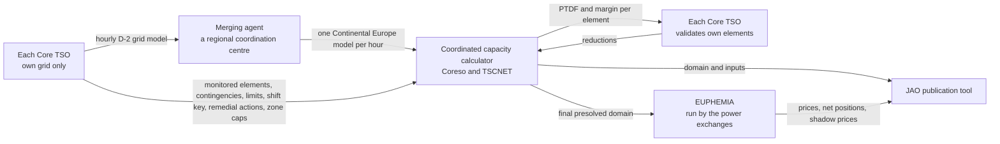

# Core day-ahead capacity calculation: from the TSOs' grid models to the auction's shadow prices

How the numbers that limit tomorrow's cross-zonal trade in Core come about, step by step, and what a simulation can use in their place. Vocabulary first, then the chain, then the shortest faithful approximation of it, then who acts and who decides. The maths of PTDF, RAM and shadow price is in [flow-based-market-coupling](flow-based-market-coupling.md); the sources are the TSOs' [explanatory note](literature/core-da-ccm-explanatory-note.md), JAO's [handbook](literature/jao-core-publication-handbook.md) and the [EUPHEMIA description](literature/euphemia-public-description.md).

## Vocabulary

- **D, D-1, D-2.** D is the delivery day. The auction for D clears on D-1 at noon. The grid models for D are built on D-2. "D-2 evening" is the last moment before anything about D is published, and the cutoff a forecast is measured against.
- **Net position.** A zone's exports minus imports in an hour, in MW. The auction's decision variables, one per zone and hour.
- **The domain.** The set of linear constraints the auction must respect: one row per monitored element under an assumed outage, reading "PTDF · net positions ≤ RAM", plus rows that cap a zone's net position. JAO publishes three versions for D on D-1: initial at 01:15, pre-final at 08:00, final at 10:30. JAO's publication tool is a website with one table per dataset and a web service behind it; "page" below means one of those tables.
- **Critical network element, with contingency.** A line or transformer a TSO monitors is a critical network element. Paired with a contingency, the assumed outage of some other element, it is a critical network element with contingency, one row of the domain. About 105 of 116 presolved rows in a sampled hour were such pairs; the rest are the element alone or a zone cap.
- **Rating and margins.** `fmax` is the element's maximum flow in MW, from its current rating in amperes and its voltage; fixed, seasonal, or dynamic, changing hour by hour with the weather. The reliability margin `frm` is held back for forecast error. `ram`, the remaining available margin, is what is left for cross-zonal trade after the base flow and the margins are deducted: the right-hand side of the row.
- **Shadow price.** After the auction, for each row that bound, the welfare one more MW of RAM on it would have bought, in €/MW. Published per binding row and hour.
- **Price spread.** The difference between two zones' day-ahead prices in an hour, published per border.
- **Vertical load.** The load the transmission grid sees at its substations: consumption minus the generation connected below it, in distribution grids, called embedded generation (rooftop solar, small wind and hydro). Not total consumption: for Germany at noon it is a tenth of it.
- **Phase-shifting transformer.** A transformer whose tap changer shifts the voltage angle and so steers power between parallel paths. Its tap position is an hourly operational setting, like a valve.
- **Generation shift key.** For each zone, the shares by which a change in the zone's net position is spread over its plants. It turns nodal sensitivities into zonal PTDFs and is the auction's only notion of what happens inside a zone.
- **Remedial action.** A measure a TSO can take to relieve an element: a phase-shifter tap or a topology change, which cost nothing, or redispatching plants, which costs money. The domain computation uses only the costless kind.
- **D2CF and RefProg.** Two JAO pages published with the final domain. D2CF, the D-2 congestion forecast, gives per zone the vertical load, generation and net position from the TSOs' grid models. RefProg, the reference programme, gives the cross-border exchanges assumed when the models were merged.

## The chain, step by step

Each step names what it consumes, what of that JAO publishes for D and when, and what stands in for it in a simulation that commits at D-2 evening. Identities marked *verified* were checked on the first hour of 2024-08-29.

1. **Aligning net positions (D-2, an ENTSO-E process).** Each TSO forecasts its zone's net position for every hour of D and a Europe-wide alignment makes them consistent. Published at 10:30 D-1 as D2CF and RefProg. Stand-in: the net positions of our own base-case solve.

2. **Individual grid models (D-2, each TSO).** Each TSO builds an hourly model of its own grid for D: topology with planned outages, phase-shifter taps, forecast load per node, forecast output per plant, HVDC flows. None of it is published; D2CF gives only the per-zone totals, and planned outages appear on ENTSO-E's transparency platform as they become known. Stand-in: PyPSA-Eur's model of the day, the OSM grid, the plant registry, weather-driven availability, the load shape, cost dispatch; outages not yet.

3. **Merged model (D-2, the merging agent, a regional coordination centre).** The individual models are checked and merged into one model of Continental Europe per hour; a late or broken one is replaced by a fallback. Not published. Stand-in: our grid is one model already.

4. **The TSOs' inputs (each TSO).** Each TSO supplies its list of monitored elements with their contingencies, the rating type and current rating of each, the reliability margins (computed centrally once a year from forecast-versus-realised flows; a TSO may reduce its own within 5 to 20 % of the rating), its generation shift key, its zone caps, the remedial actions it offers, and the long-term rights already sold. How the list is decided: cross-zonal lines are always in; an internal element is in when a trade between some pair of Core zones would push at least 5 % of its volume over it, checked on the merged model, or when the TSO wants it in from its own security studies; the contingencies are the outages it plans against. It is a maintained list, not the result of an optimisation, and it changes little from day to day. Published: per row of the domain pages the element name, the contingency's branches, `imax`, `u`, `fmax`, `fmaxType`, `frm` and `minRamFactor`; remedial actions and long-term rights on their own pages at 10:30; zone caps as domain rows whose only PTDF is a one on the capped zone. The shift key is never published as numbers; the explanatory note gives each TSO's recipe, such as pro rata to the D-2 output of its dispatchable plants. Stand-in: D-1's domain rows as the skeleton, so the same list, fixed and seasonal ratings exactly right, dynamic ratings a day old, the same `frm` and `minRamFactor`; a shift key built by the note's recipe from our own dispatch; D-1's zone caps; no remedial actions.

5. **Load flow (the coordinated capacity calculator, Coreso with TSCNET).** A DC load flow with contingency analysis on the merged model gives, per row, the flow at the aligned net positions (`frefInit`), the nodal sensitivities, and through the shift key the zonal PTDFs (`ptdf_<hub>`). Two more flows per row: `fall`, the flow if every Continental exchange were zero, and `fuaf`, the flow caused by the assumed exchanges with non-Core zones; their sum `fcore` is the flow without Core exchanges. Rows under the 5 % threshold stay listed but never reach the auction. Published on the three domain pages. Stand-in: our grid's DC sensitivities times our shift key for the PTDFs, our base-case flows, and `fall` and `fcore` from a solve with exchanges fixed at zero, or D-1's values.

6. **Remedial-action optimisation (calculator).** Costless actions are chosen to enlarge the domain in the expected direction of trade; the flow change per row is `fnrao`, and the base flow becomes `fref = frefInit + fnrao`. Published with the domain, the chosen actions on their own page. Stand-in: none; D-1's `fnrao`, or zero.

7. **Minimum margin (calculator).** Regulation (EU) 2019/943 requires at least 70 % of an element's capacity to be available to cross-zonal trade; elements under a derogation have lower factors. Where `fmax − frm − fall` falls short of `minRamFactor · fmax`, the shortfall `amr` is added to the margin: capacity the TSO promises to make real with redispatch after the auction. *Verified*: `amr = max(0, minRamFactor · fmax − (fmax − frm − fall))` on all 459 lifted rows; the factor was 70 for about half the presolved rows and 20 to 62 for the rest. Stand-in: D-1's factor per element.

8. **Long-term rights (D-1, calculator).** Capacity sold months ahead must remain feasible, so the domain is enlarged where needed (`ltaMargin`) and shifted by the long-term nominations (`fltn`). Published on the `lta` and `ltn` pages at 10:30. Stand-in: D-1's columns; zero in the sampled rows.

9. **Validation (D-1, each TSO).** Each TSO checks the domain against its own security analysis and may only reduce, on its own elements, with a published justification: `cva` when coordinated, `iva` when individual. Stand-in: D-1's values, or zero.

10. **Final computation and presolve (calculator).** RAM per row, *verified*: `ram = fmax − frm − (fcore + fltn) + amr − iva` on all 116 presolved rows. Presolve then drops every row the others already imply; about 120 rows per hour out of some 11,500 remain, flagged `presolved`, and only those are handed to the auction. Published at 10:30 D-1. Stand-in: RAM from the stand-ins above; redundancy is a solver's concern, not a forecaster's.

11. **Clearing (12:00 to 13:00 D-1, the power exchanges).** EUPHEMIA maximises welfare over the bids, subject to the presolved rows, the allocation constraints it receives outside the domain, and the ATC borders elsewhere in Europe. Out come zonal prices, net positions and, for each binding row, its shadow price. Published: shadow prices with the rows' PTDFs at 13:00; net positions and price spreads at 15:50; prices by the exchanges. The bids only as aggregated curves per zone, sold under internal-use licences. Stand-in: cost-based zonal curves from PyPSA-Eur's fleet with the day's fuel and carbon prices; D-1's binding set as the persistence prior.

## The shortest faithful approximation

The rows handed to the auction are the product of the whole chain: a TSO's list, the day's flows, the margins, the presolve. But most of it persists overnight. The list, the ratings, the reliability margins and the minimum-RAM factors change little; what changes daily is the base flows, the dynamic ratings, and therefore RAM. So a simulation at D-2 evening need not replay eleven steps. Take D-1's presolved rows as the skeleton (step 4); compute the day's PTDFs and base flows on our grid with a shift key (step 5); rebuild RAM by the identity of step 10; clear cost-based zonal curves against the result (step 11). Steps 1, 6, 8 and 9 come from D-1's columns or are zero. The candidate set is D-1's presolved rows, about 120 per hour; a row redundant yesterday can bind today, so D-1's full list is the refinement. D-1's rows unchanged are the persistence prior, and D-1's binding set is the baseline any model must beat.

## What a faithful simulation needs

- The auction's variables are zonal net positions. A zone's change lands on its plants through the shift key, not through re-optimisation, so a model that redispatches inside a zone to relieve a monitored element solves a different problem from the auction's.
- The flow on a monitored element is its base flow plus PTDF times the change in net positions. PTDFs and base flows come from a full nodal model. For day D at D-2 evening only ours exists; JAO's are a day old.
- Margins are per element and mostly persistent: fixed or seasonal ratings for about half the elements, a yearly reliability margin, a per-element minimum-RAM factor. The day-specific parts are the base flows and the dynamic ratings.
- Zone caps and the ALEGrO virtual hubs are rows like any other, one PTDF each; the network carries ALEGrO as a DC link at its rating.
- Bids are the one input sold rather than published; a cost proxy needs the day's fuel and carbon-allowance prices.
- Not knowable anywhere at D-2: the merged model's topology and phase-shifter taps, the per-plant forecast dispatch, the shift key's numbers, the remedial actions chosen for D.

## Who acts, and who decides alone

Each TSO models only its own grid, and nobody co-optimises the grid Europe-wide; the one Europe-wide optimisation, EUPHEMIA, sees only the zonal constraints it is handed. In between sits one central computation on a merged model, run on the TSOs' behalf by two regional coordination centres, Coreso and TSCNET ([ENTSO-E's Core page](https://www.entsoe.eu/bites/ccr-core/day-ahead/)). ENTSO-E sets the standards and runs the alignment of net positions; it computes no capacity. JAO publishes; it computes nothing. The auction belongs to the power exchanges.

| Actor | Does | Decides alone |
|---|---|---|
| Each Core TSO (16) | Builds an hourly grid model of its own area for the day after tomorrow: topology, outages, forecast load, generation and DC flows | Which elements are monitored and under which outages; each element's current limit (fixed, seasonal or dynamic); whether to cut its elements' centrally computed reliability margin, down to 5 to 20 % of the limit; how an extra exported MW is spread over its plants (the generation shift key); which remedial actions it offers; caps on its zone's net position |
| Merging agent (a regional coordination centre) | Checks each model, substitutes a fallback for a late or broken one, merges all of Continental Europe into one model per hour | Nothing about capacity |
| Coordinated capacity calculator (Coreso with TSCNET) | DC load flow with contingency analysis on the merged model: nodal sensitivities by perturbing each node, zonal PTDFs through the shift keys, reference flows, remedial-action optimisation, minimum-margin adjustment, long-term-rights inclusion, presolve; computes the reliability margins once a year from a year of forecast-versus-realised flows | The redundant constraints it drops |
| Each Core TSO again | Validates the domain against its own security analysis | May only reduce, on its own elements, with a published justification |
| JAO | Publishes the domain at 10:30 D-1 and the shadow prices at 13:00, local time | Nothing |
| Power exchanges (NEMOs) | Run EUPHEMIA against the presolved constraints | The clearing, within a 12-minute limit |
