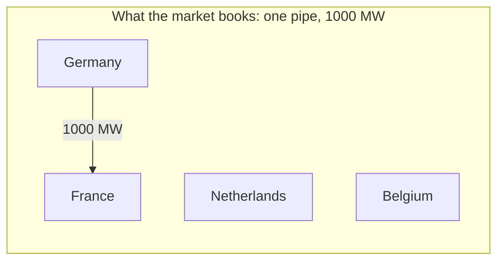
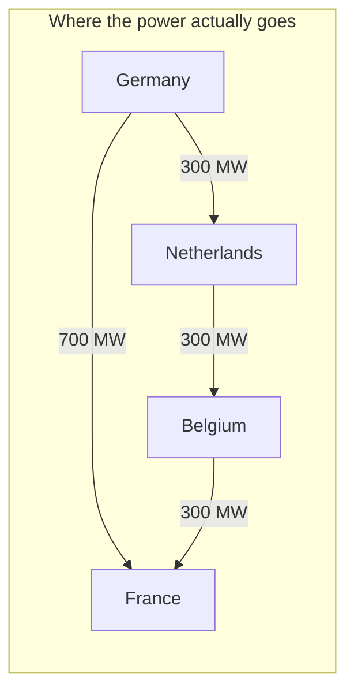
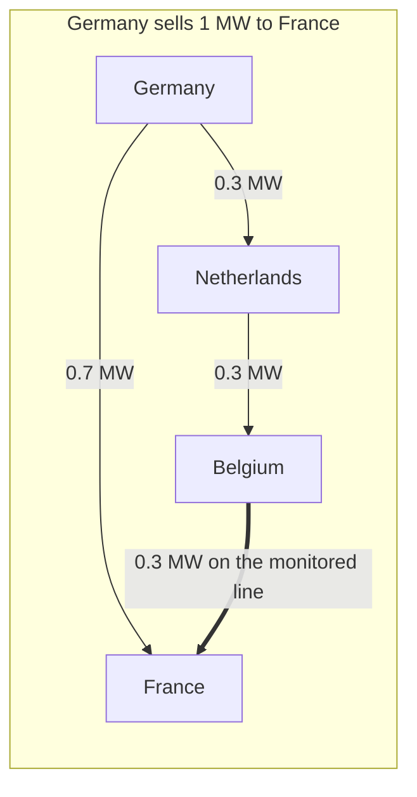
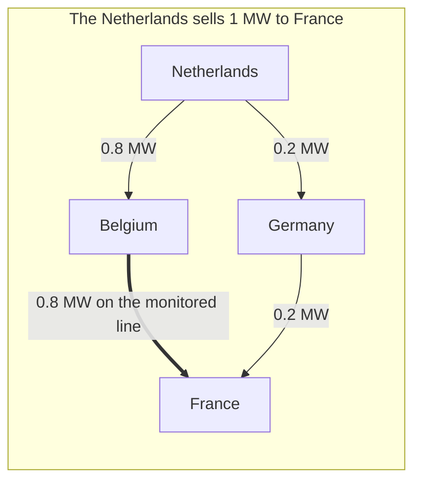

# Flow-based market coupling — Core versus the NTC borders

How the European day-ahead market decides how much power may cross a border between two bidding zones, and why the method differs by region. Context for [specs/core-congestion-forecast](specs/core-congestion-forecast.md); the wider market-design argument is in [copper-plate-problem](copper-plate-problem.md).

## The question both methods answer

The day-ahead auction ([EUPHEMIA](literature/euphemia-public-description.md)) sets one price per bidding zone, usually a country. It pretends the grid inside a zone has no limits. Between zones it needs to know how much power may be traded tomorrow. The grid operators (TSOs) have to give the market that limit before bids close. There are two ways to describe it.

## Method 1: NTC, one pipe per border

**Net Transfer Capacity** (NTC) is a single number per border and direction. The TSOs on both sides agree: tomorrow, at most X MW may be sold from Germany to France. The market sees one pipe per border and nothing else.

The trouble is that electricity does not follow the pipe. It spreads over every parallel path in the grid, in proportion to how easy each path is. When Germany sells power to France, part of it flows through the Netherlands and Belgium on the way. Illustrative numbers:





Nobody booked the 300 MW crossing the Netherlands and Belgium. Their lines carry it anyway. This has three consequences.

1. **Third parties pay for trades they are not part of.** The Dutch and Belgian TSOs must keep room on their lines for flows caused by German-French trades. They do that by lowering their own NTCs, so Dutch and Belgian traders get less capacity because of a deal made elsewhere.
2. **Every NTC is set low on purpose.** A TSO does not know tomorrow's trades in other zones, so it reserves room for the worst case. Capacity reserved this way is never used.
3. **The number carries no reason.** A TSO may lower the NTC without saying why. Through August 2026 the Spain–France schedules sat flat at 500 to 800 MW on 2.8 GW of wire while the two prices differed by 30 to 140 €/MWh (RTE eco2mix; Electricity Maps). A flat schedule under a wide spread is what a binding cap looks like, but the schedule alone does not prove it; the offered capacity published by the TSOs does.

### How a TSO arrives at the number

The same load-flow study that starts flow-based coupling ([core-day-ahead-capacity-calculation](core-day-ahead-capacity-calculation.md)), with a different last step. The operators on both sides push a growing exchange from A to B through a forecast of tomorrow's grid, assuming which plants in A ramp up and which in B ramp down, and stop at the first limit: a line at its thermal rating, a line that would overload if some other line tripped, or on some borders a voltage or stability limit found in separate dynamic studies. That exchange is the *total transfer capacity*. A reliability margin for forecast error comes off it; the result is the NTC. Capacity already sold as long-term rights comes off next; what is left is the *available transfer capacity* the auction gets. Each side computes its own number and the lower one applies.

NTC freezes one scenario for every other border, finds where this border's pipe would burst under it, and publishes that single number. Flow-based publishes the lines and their sensitivities and lets the market pick the combination. On Spain–France, voltage and stability constraints can hold capacity well below what the interconnectors could carry thermally, even though the offered capacity varies.

NTC still governs most European borders: Spain–France–Portugal, the Italian borders, the Baltic states, South-East Europe, Great Britain's interconnectors, and the borders between Core and the Nordic countries. Since June 2026 the borders on Core's edge are a hybrid (*advanced hybrid coupling*): each still gets a border-level capacity, but the exchange over it also competes for room on Core's flow-based constraints, as a virtual hub with its own sensitivities. So at Core's edge the pipe is no longer blind to what it does inside Core.

## Method 2: flow-based, limits on the lines themselves

**Flow-based market coupling** gives the market the grid's physics directly, in a simplified linear form. Instead of a pipe per border, the TSOs pick the lines that matter and publish, for each one, how much of every trade lands on it and how much room it has left. Take the Belgium–France line from the example above and follow one traded megawatt.





Those shares are the **PTDF** (power transfer distribution factor) of the Belgium–France line: 0.3 for German-French trades, 0.8 for Dutch-French trades. A share, not an amount. Every monitored line has one for each pair of trading zones.

The line's second number is an amount: its **RAM** (remaining available margin), the megawatts of room it has left for cross-zonal trades. It is not derived from the PTDF. It comes from a subtraction the TSOs do the day before, and the middle row is the one that matters:

| Belgium–France line | MW |
|---|---|
| Physical limit | 1000 |
| Safety margin the operator keeps for forecast error | 100 |
| Flow it already carries with no cross-zonal trade at all, because Belgian plants serve Belgian towns over it | 400 |
| Room left for trades: the RAM | 500 |

That 400 MW is the operators' forecast of tomorrow's dispatch *inside* every zone: which Belgian plants run, where Belgian demand sits, and so what flows over each monitored line before any cross-border trade happens. The market never sees this flow and cannot change it; it is forecast, then deducted. RAM is therefore room for trades between zones only.

The market now solves a shared budget:

```
0.3 × (German sales to France) + 0.8 × (Dutch sales to France) ≤ 500 MW
```

If Germany sells 1000 MW to France, 300 MW of the room is used and the Dutch can sell 250 MW before the line is full. If Germany sells 1667 MW, the Dutch get nothing. The same budget exists for every other monitored line, and the market picks the trades worth the most inside all of them at once. A line monitored this way is called a **critical network element with contingency** (CNEC): a line or transformer, checked under the assumption that some other line is out.

## What the market cannot see, and who pays for it

Because flow inside a zone is deducted rather than decided, three things follow.

- **Internal congestion becomes lost trading capacity.** If northern German wind must cross Germany to reach southern demand over a monitored line, that internal flow eats the line's RAM, and traders in Poland or France lose capacity for a problem that is Germany's alone. This is the copper-plate argument in numbers.
- **The 70 % rule attacks exactly this.** Since 2020 the law (Regulation (EU) 2019/943, Article 16(8)) requires the RAM to be at least 70 % of a line's thermal capacity, whatever the internal forecast flow. If the internal flow does not fit in the remaining 30 %, the operator must fix it after the auction by paying plants to move (redispatch). The rule moves the cost of internal congestion from foreign traders to the zone's own grid fees. TSOs can get exemptions; ACER checks compliance every year.
- **A wrong forecast means a different real flow.** The safety margin covers small errors; redispatch covers the rest.

One more assumption hides in the PTDFs. When a zone's net export rises by a megawatt, the operators must assume which plants inside the zone produce it, since the market does not say. That assumption is the **generation shift key**, and it decides the shares.

When an element hits its limit, it gets a **shadow price**: the value of one more MW of room on it. That shadow price is what splits zonal prices. (A second, rarer cause: the TSOs also cap some zones' total imports or exports for stability, called **external constraints**, and one of those binding splits the zone's price with no line involved.) The more a zone's exports load the element, the lower its price; the importing side gets the highest. In the example, if the Belgium–France line binds, the Netherlands (0.8 of every exported MW lands on it) gets the lowest price, Germany (0.3) sits between, and France is highest. A price split under flow-based coupling therefore names its cause: this element or this zone limit, at this hour.

The naming is the auction's own arithmetic. Zonal prices are duals of the clearing problem, so two zones' price difference in an hour equals the sum, over that hour's binding constraints, of each constraint's shadow price times the difference of the two zones' PTDFs on it; a zone cap is a constraint with a single PTDF of one. Checked on 2024-08-29 against the constraints JAO publishes: over 874 zone-pair hours the sum matches the published spread with a correlation of 0.997 and the right sign on all 202 spreads above 20 €/MWh. In ten of the 23 hours with a binding constraint the match is within 2 %; in the others the published spread deviates by up to half, more often above than below, by a factor that changes hour to hour, which points to binding constraints the shadow-price page does not list rather than to a unit or scaling error. Which constraints is open; candidates are the long-term-allocation facets EUPHEMIA adds to the domain and the allocation constraints it receives outside it. At 18:00 CEST the published 709 €/MWh spread between Austria and Slovenia had 627 from the Obersielach–Podlog line, −42 from Altheim–St. Peter and 10 from a Slovak line, 595 in all; the remaining 113 are that unlisted share. So the elements that bind, weighted by their PTDFs, carry the zonal spreads, and no nodal price is needed to connect the two. JAO, the TSOs' joint allocation office, publishes it all: the element list, the PTDFs, the margins, and the shadow prices after the auction ([handbook](literature/jao-core-publication-handbook.md)). Three rows at their limit, room used to the megawatt and the price of one more, are read in [Binding](core-day-ahead-capacity-calculation.md#binding).

Flow-based coupling started in Central Western Europe in 2015. It covers the **Core** region since June 2022: Austria, Belgium, Czechia, Germany-Luxembourg, France, Croatia, Hungary, the Netherlands, Poland, Romania, Slovenia and Slovakia. The Nordic countries followed in October 2024.

## Day-ahead timeline, Core, CET

| D-2 | TSOs' grid models merged and the domain computed ([core-day-ahead-capacity-calculation](core-day-ahead-capacity-calculation.md)) |
|---|---|
| D-1 ≈ 10:30 | JAO publishes the elements, PTDFs and margins for tomorrow |
| D-1 12:00 | Bids close |
| D-1 ≈ 13:00 | Prices per zone and shadow prices per element come out |
| D-1 15:00 | Intraday trading for tomorrow opens |

## The difference in five lines

- **What is limited**: NTC limits a border. Flow-based limits grid elements.
- **Third-party flows**: NTC cannot see them and reserves room blindly. Flow-based measures and prices them. Core's edge borders are the hybrid case since June 2026.
- **Capacity for the market**: flow-based gives more of the wire where it is really free, and less where a distant element is full.
- **What a price split means**: under NTC, a full pipe. Under flow-based, a full element, possibly in a third country, or a binding cap on a zone's net position.
- **Transparency**: NTC is one number with no stated reason. Flow-based publishes the limits and what they cost.

## What this means for this project

A nodal optimal power flow is what flow-based coupling approximates. The PTDFs are the sensitivities a DC power flow computes, summed up to zones. The margins are line limits minus a safety factor. The shadow prices are the line duals. PyPSA-Eur caps every line at 70 % of its thermal rating, which plays the role of the safety margin.

The bids are the part no public model has. Since October 2021 the exchanges publish each zone's aggregated supply and demand curves, all NEMOs' orders combined, after the auction, as yearly subscriptions under internal-use licences that forbid republishing: EPEX per market area through the EEX webshop, Nord Pool as a Central Europe bundle of AT, BE, DE-LU, FR, NL and PL plus Romania as a single country. Between them they cover seven of Core's twelve zones; CZ, HU, HR, SI and SK come from neither. Until costs are calibrated to those curves, PyPSA-Eur's marginal costs stand in for bids, and they must carry the day's fuel and carbon-allowance prices: at 2024's roughly €70 a tonne the allowance adds €60 to €95 per MWh to coal and lignite and €25 to €30 to gas, and without it the merit order puts coal below gas.

What our model does not copy from the TSOs: which elements they choose to monitor (in Core, those where a zone-to-zone trade moves at least 5 % of its power, per the TSOs' [methodology note](literature/core-da-ccm-explanatory-note.md)), how they assume a zone's extra export is spread over its plants, tomorrow's outages and phase-shifter settings in their base case, the exact safety margins, and the extra limits they put on whole zones for stability. The congestion-forecast spec predicts binding lines and price splits from physics alone and scores them against JAO's published shadow prices. The distance between the two is exactly that list.
