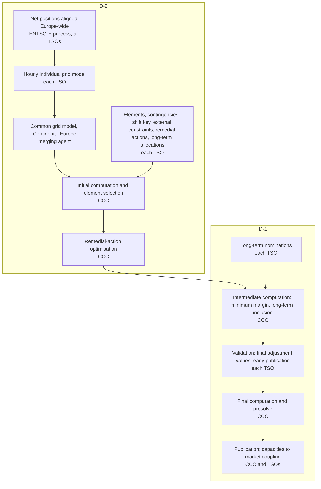

# Explanatory note on the Core day-ahead and intraday flow-based capacity calculation methodology

**Issued by** the sixteen Core TSOs, 4 June 2018, alongside their methodology proposal under Article 20 of the CACM Regulation (EU) 2015/1222. Hosted by ACER: [PDF, 37 pages](https://acer.europa.eu/sites/default/files/documents/en/Electricity/MARKET-CODES/CAPACITY-ALLOCATION-AND-CONGESTION-MANAGEMENT/16%20CCM/Action%204%20-%20CCM%20Core%20explanatory%20document.pdf). The legal text it explains is the Core day-ahead capacity calculation methodology, approved by [ACER Decision 02/2019](https://www.acer.europa.eu/sites/default/files/documents/Individual%20Decisions_annex/Annex%20Ia%20-%20Decision%20on%20Core%20CCM_0.pdf) and amended three times since; the [third amendment, clean version, 8 Dec 2023](https://eepublicdownloads.entsoe.eu/clean-documents/nc-tasks/Core%20DA%20CCM%203rd%20RfA%20-%20Clean%20version.pdf) is the text in force. This note predates go-live (8 June 2022); see "What changed since" below.

**Draws on it:** [core-capacity-calculation](../core-capacity-calculation.md), [flow-based-market-coupling](../flow-based-market-coupling.md), [specs/jao-grid](../specs/jao-grid.md), [specs/core-congestion-forecast](../specs/core-congestion-forecast.md).

## The process it describes

Chapter 3 lays the day-ahead process out as eleven steps against the actors. Coordinated capacity calculator is CCC.

## What it settles

**The computation is central, the inputs are not.** The individual grid models are hourly and carry topology, forecast generation, load and DC-link flows, with HVDC as load or generation; the merging entity substitutes a fallback for a late or rejected one, and the merged model covers all of Continental Europe. Net positions for the models come from ENTSO-E's centrally operated common grid model alignment. At validation, TSOs may only reduce.

**Physics is linear and active-power only.** The PTDFs are described as the linearisation of the model, and elements are assumed loaded by active power alone (power factor 1); a TSO whose element carries substantial reactive flow sets a final adjustment value at validation. The [2017 consultation draft](https://consultations.entsoe.eu/markets/core-da-ccm/user_uploads/explanatory-note-for-core-da-fb-cc-public-consultation_fv.pdf) of this note says it outright: contingency analysis "based on a DC load flow approach".

**PTDFs come from the merged model.** Zone-to-slack PTDFs are the flow change on a CNEC per MW of net-position change of a zone, with the slack absorbing it. Zone-to-zone PTDFs are differences of zone-to-slack values; the largest such difference per CNEC is its maximum zone-to-zone PTDF.

**CNEC selection.** Cross-zonal elements are always in. An internal element qualifies when its maximum zone-to-zone PTDF exceeds 5 %, or when the TSO deems it necessary. The note argues this against both extremes: no internal elements (redispatch absorbs everything) and all internal elements (internal congestion blocks all trade).

**Reliability margin is statistical.** For every hour of a year, the D-2 model is corrected to the real phase-shifter positions, its flows shifted to the realised net positions through its own PTDFs, and compared with realised flows from real-time snapshot models under the same contingencies. The 90th percentile of the error distribution per CNEC (or per element, at the TSO's choice) is the FRM. The CCC computes it centrally once a year. Before the first statistics, and for any new element, FRM is 10 % of the maximum admissible flow. A TSO may adjust the statistical value operationally, but only downward and only within 5 to 20 % of the maximum admissible flow, with justification reported to regulators annually.

**Limits are the TSO's own.** The maximum admissible current is set by each TSO from its security policy: permanent or temporary, fixed, seasonal or dynamic where the equipment exists. An element limited by a breaker or current transformer rather than the conductor gets a constant limit.

**Generation shift key is per TSO, no common formula.** Appendix 1 gives each TSO's recipe. Three families: shift proportional to each dispatchable unit's D-2 output (Czechia, France, Poland, Romania, Slovakia; Croatia, Slovenia and Hungary add load nodes for lower-voltage generation; Czechia, Romania, Slovakia and Slovenia exclude nuclear); market-driven units only, chosen by statistics, base load excluded (Austria; Germany's four TSOs each build one and weight them into a single German key); pro-rata between per-unit minimum and maximum levels chosen for extreme import and export (Belgium, Netherlands). The GSK must be constant per market time unit because the price-coupling algorithm needs a convex domain.

**Remedial-action optimisation** enlarges the domain in the forecast market direction using the actions TSOs offer (phase-shifter taps, topology). Limits per contingency: at most two TSOs involved and at most eight curative actions (three for RTE, two for PSE). Elements below the 5 % threshold can be listed as monitored so the optimisation does not overload them; a 50 MW tolerance keeps low-sensitivity ones from binding.

**Minimum margin.** In this edition the margin without Core exchanges must be at least 20 % of the maximum admissible flow; an adjustment for minimum RAM lifts it when it is not. Together with the 5 % threshold this bounds how restrictive a low-sensitivity element can be.

**Long-term rights.** The domain is enlarged so that every combination of already-allocated long-term capacities stays feasible (LTA inclusion); the CWE virtual-constraint method was dropped because it does not scale to Core's eleven dimensions. Long-term nominations then shift the reference flows.

**Presolve.** The CCC removes constraints that cannot bind; only the presolved set goes to the market. Every redundant constraint is still respected by construction.

**Fallbacks.** Up to two consecutive missing hours are spanned from their neighbours, longer gaps get default parameters, and if coupling itself fails, shadow-auction ATCs are derived from the domain.

**External constraints** cap a zone's net position for reasons the linear model cannot express (voltage, stability); they appear as rows with a single ±1 PTDF or go to the market separately as allocation constraints. Three pages argue their legal basis.

## What changed since

- **70 % rule.** Regulation (EU) 2019/943 Article 16(8) added a second floor: the margin plus the flow from non-Core exchanges must reach 70 % of the element's capacity, with linear trajectories and derogations during transition. The 20 % floor stays and the larger of the two applies; the third amendment carries both.
- **Advanced hybrid coupling** replaced standard hybrid coupling for Core's edge borders; the note describes only the standard form, where non-Core exchanges enter through the base case.
- **Extended LTA inclusion**: EUPHEMIA now receives the untouched domain plus the long-term domain and takes their union itself ([euphemia-public-description](euphemia-public-description.md)). An [amendment submitted in 2026](https://www.acer.europa.eu/news/acer-amend-electricity-day-ahead-capacity-calculation-methodology-core-region) removes long-term allocations from day-ahead capacity calculation entirely; ACER decides by 30 September 2026.
- **Central Europe.** Core and Italy North merged into the Central Europe region (ACER Decisions 04/2024 and [10/2025](https://www.acer.europa.eu/sites/default/files/documents/Individual%20Decisions_annex/ACER-Decision-10-2025-Annex-II.pdf)). The TSOs' [explanatory document of October 2024](https://consultations.entsoe.eu/markets/central-europe-da-ccm/supporting_documents/20241017%20Explanatory%20Document%20CE%20DA%20CCM%20%20PC%20version.pdf) covers only the delta: Swiss and Italian integration, HVDC on Central Europe borders, tie-lines below 220 kV that the merged model does not carry, and dropping the obligation to phase out seasonal limits.
