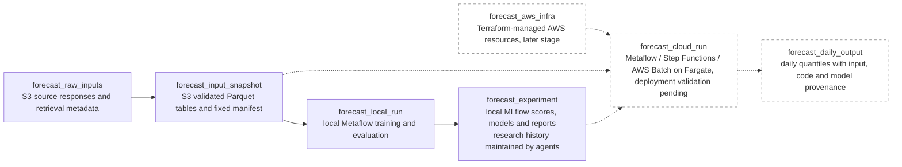

# Price forecasting

An independent forecasting product under `forecasts/`, with no dependency on the power-flow application. The first market is Germany–Luxembourg day-ahead electricity prices. As of 2026-10-09, typed S3 inputs, local training/evaluation and experiment tracking are implemented; cloud execution remains planned.

## Design

- [Forecast contract](price-forecasting/germany-luxembourg.md): market, deadline, inputs and outputs.
- [Storage and execution](price-forecasting/forecast-infrastructure.md): reproducibility promise, selection principle, local first iteration and later AWS deployment.
- [Data sources](price-forecasting/data-sources.md): verified contracts and availability limits.
- [Evaluation](price-forecasting/evaluation.md): chronological comparisons and scoring.
- [Implementation spec](specs/day-ahead-price-forecast.md): remaining work and acceptance checks.

## Dataflow

Solid nodes and edges represent implemented parts; dashed nodes and edges (`planned`) represent planned parts. Each arrow means "required to produce." Cloud execution is a later stage, subject to deployment validation.

