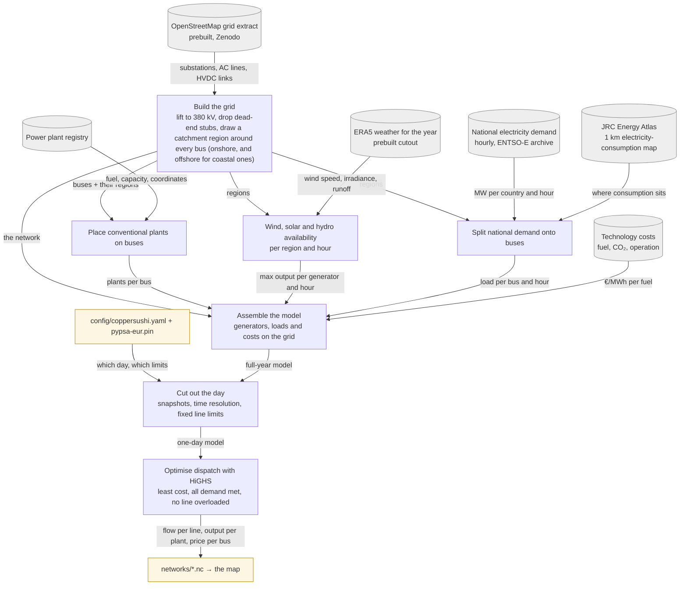

# PyPSA-Eur as a pinned sibling checkout

PyPSA-Eur runs from `../pypsa-eur`, a clone of the [fork](https://github.com/zoltanmaric/pypsa-eur) as its single remote `origin` (fetching all heads), pinned by `pypsa-eur.pin` in this repo. What the fork holds is the Fork refs table below. **Upstream [PyPSA/pypsa-eur](https://github.com/PyPSA/pypsa-eur) is not a remote of this checkout**, so `origin/master` is the fork's mirror of upstream and nothing local can tell you how stale it is — syncing means adding upstream as a remote first. Nothing of ours lives in that checkout: config, runner and any enhancement scripts are here.

## Why a sibling and a pin file

Needs: a versioned pin tying our config to the workflow code it targets; no vendoring; occasional upstream-bound patches; several agents in `worktrees/` at once; tens of GB of cutouts and results that must exist once. A submodule is checked out per worktree (a clone and a data directory per agent); a gitignored clone inside the repo is absent in worktrees; Snakemake's remote `module` fights a data-heavy workflow. The sibling with a pin file costs one hand-edited line per bump and satisfies everything else.

## How we configure and reuse it

- **`pypsa-eur.pin`**: two lines, a repository URL and a commit SHA; the runner fetches that commit from that URL into the sibling. It is provenance: each sanctioned network in `networks/` was produced by the pin **and the config** at the commit that added it (v1's predates the pin), so the shelf is not uniform and is not meant to be — the config file describes one day at a time. As of 2026-09-09 only `opf-2024-08-29.nc` is on the hourly CET market day; `opf-2013-07-17.nc` is a UTC-day, 2-hourly network from `9486a0a`, solved before carbon pricing, dynamic fuel prices, the `powerplants_filter` and `assign_all_duals` entered the config, and `opf-2013-07-17-v1.nc` is older still (the 2022 fork, tag `coppersushi-v1`). Neither was re-solved for the market-day move: 2013-07-17 predates Core flow-based coupling (June 2022), so it carries no JAO data and its day convention is inert; as of 2026-09-09 the pinned head of the fork's `coppersushi` branch (Fork refs below) carries the five fixes of the open rehearsal PRs — the three `clusters: all` ones plus the monthly fuel-price and pandas 3 CO2-price fixes ([ledger](upstream-contributions.md)). The pin moves only in a commit that also promotes a network — point the local pin at a newer head, solve, promote, then commit SHA and network together and tag the SHA once that commit lands on `main` (`pin/*` row below). New layers on the branch alone never move it; a config change that needs branch-only code waits for that promotion commit.
- **Runner** (`coppersushi/pypsa_eur.py`; `coppersushi/networks.py` names and locates the results): locates the sibling from git's common directory — the main checkout's parent, so it resolves identically from any worktree under `worktrees/` — overridable by `PYPSA_EUR_DIR`; reads the pin; refuses a checkout with modified tracked files; unless HEAD already is the pin, fetches it and checks it out detached; verifies HEAD equals the pin; runs `pixi run snakemake -call solve_elec_networks --configfile <abs path>/config/coppersushi.yaml`; copies the single `.nc` under `results/<run.name>/networks` to the gitignored `networks/candidates/opf-<day>-<pin>.nc`. **Sanctioning is a separate, human step**: `promote` copies a candidate to `networks/opf-<day>.nc` and stages it; the commit makes it a Git LFS object. LFS keeps every committed version forever and GitHub does not prune them, so solves are iterated outside git and sanctioned rarely (`networks/AGENTS.md`).
- **`config/coppersushi.yaml`**: only what deviates from `config/config.default.yaml`, written against `config/schema.default.json` — the run name, the OSM grid at `clusters: all`, upstream's countries plus UA and MD, the day, and the solver settings. The file is the list, each key carrying its reason inline; the ones that make a day's weather, fleet, fuel and carbon its own are explained in [backtest-2024-08-29](backtest-2024-08-29.md). Upstream's `config/examples/config.validation.yaml` is *not* the template — it carries keys the code ignores as of 2026-09-08.
- **Data** stays in the sibling: `data/`, `cutouts/`, `resources/`, `results/`. The prebuilt cutout and the osm-prebuilt grid are retrieved by upstream rules; nothing is fetched by us.
- **Cutouts hold one calendar year each**, named `europe-<year>-sarah3-era5` (atlite: solar irradiance from SARAH-3, wind, temperature and runoff from ERA5); `atlite.default_cutout` picks one and upstream defaults to `europe-2013-sarah3-era5`. **A run whose `snapshots` move to another year must move the cutout with them.** PyPSA-Eur rejects a mismatch — `load_cutout` slices the cutout with `sel(time=snapshots)` — but only after the 6.7 GB download, and the message names neither the cutout nor the config key, so `tests/test_pypsa_eur.py` compares the two years up front. (`europe-1940-2024-era5` is an entry in upstream's `cutouts:` map — a recipe for *building* a cutout from CDS, its own `time:` reading `['2013','2013']` — not a file: `data.pypsa.org/workflows/cutout/v1.0/europe-1940-2024-era5.nc` 404s.)
- **Environment**: pixi in the sibling (`pixi install`, `pixi shell`), upstream's preferred method.

## Dataflow: from raw data to the solved day

What PyPSA-Eur does with our config, in reader's terms (first run 2026-09-02: 56 rules, ~35 min of downloads and preprocessing; with Ukraine and Moldova 4390 buses, HiGHS 213 s for 12 snapshots). Edges name the data handed over; the table below maps each stage to upstream's rule names for anyone who needs the code.

| Stage | Upstream rules |
|---|---|
| Build the grid | `retrieve_osm_archive`, `build_shapes`, `base_network`, `add_transmission_projects_and_dlr`, `simplify_network`, `cluster_network` (`clusters: all`) |
| Place conventional plants | `retrieve_powerplants` (powerplantmatching), `build_powerplants` |
| Availability | `retrieve_cutout`, `determine_availability_matrix`, `build_renewable_profiles`, `build_hydro_profile` |
| Split demand | `retrieve_electricity_demand_*`, `retrieve_electricity_demand_energy_atlas`, `build_electricity_demand`, `build_electricity_demand_base` |
| Assemble | `retrieve_cost_data`, `add_electricity` → `base_s_all_elec.nc` |
| Cut out the day | `prepare_network` → `base_s_all_elec_.nc` |
| Optimise | `solve_network` → `results/coppersushi/networks/base_s_all_elec_.nc` |

Known traps, verified in upstream `563f22f6`: `clusters: all` is barely travelled upstream — three scripts assumed clustered bus names or clustered region sets and are patched on the pinned fork branch ([ledger](upstream-contributions.md)); a `powerplants_filter` on commissioning dates must be checked against the registry's date coverage or it silently empties the fleet; `transmission_limit: v1.01` makes every line extendable (`v1.0` keeps them fixed); `dynamic_fuel_price: true` gives all-NaN costs for a window not starting on a month boundary; `nuclear_p_max_pu.csv` ends 2024 and a later year raises `KeyError`; `highs-default` pins one thread; the Internet Archive copy of the 4 GB WDPA file (Ukraine/Moldova path) stalls at exactly 2 GiB on resumed downloads — `data.wdpa.source: primary` fetches the current month's file from the publisher instead. Ledger: [upstream-contributions](upstream-contributions.md).

## Fork refs (remote `origin`)

A bare `git push` in the sibling targets the fork, because the fork is the only remote — not because of a `remote.pushDefault`, which is unset. Adding upstream as a remote removes that safety by construction, so push by name once you do.

| Ref | Meaning |
|---|---|
| `master` | Pristine mirror of upstream. **Never commit here.** Syncing needs upstream as a remote, which the checkout does not have by default: `git remote add upstream https://github.com/PyPSA/pypsa-eur.git`, then `git fetch upstream && git merge --ff-only upstream/master && git push origin master`. |
| `coppersushi` | The integration branch: upstream `master` plus, cherry-picked on top, the not-yet-upstreamed fixes the solve needs — nothing else. The pin is the head that produced the sanctioned networks; the branch moves on without it — a rebuild gives even the pinned layers new SHAs, the tag keeps the pinned commit — until a solve is worth promoting. The layers are the topic branches of the fork's open rehearsal PRs ([ledger](upstream-contributions.md)), applied in PR-number order — that order is canonical. Upstream moved: `git rebase origin/master coppersushi`. A topic branch changed or a fix joins: `git switch -C coppersushi origin/master`, then `git cherry-pick origin/master..<topic>` per open rehearsal PR in that order. Conflicts: `doc/release_notes.md` at every layer (keep every bullet); elsewhere combine both layers' changes — a later layer's version alone only where it demonstrably subsumes the earlier one. Then `git push --force-with-lease origin coppersushi`. A layer drops out when its fix lands upstream. |
| `pin/<YYYY-MM-DD>-<what is new>` (tags) | One per SHA that has landed in `pypsa-eur.pin` on `main`, dated when pinned (`pin/2026-09-08-clusters-all-fixes`), pushed to `origin`, never moved or deleted — so a rebuild never orphans a pinned commit. Tag when the pin lands on `main`. |
| topic branches | Only for patches bound upstream ([ledger](upstream-contributions.md)); pushed to `origin`, tested by pointing the local pin at the branch commit, deleted once merged upstream. |
| `legacy-2022` | The old master (48 commits on PyPSA-Eur 0.5). Archive. |
| `coppersushi-v1` (tag) | The commit whose `config.yaml` produced v1's bundled network `opf-2013-07-17-v1.nc`. |
