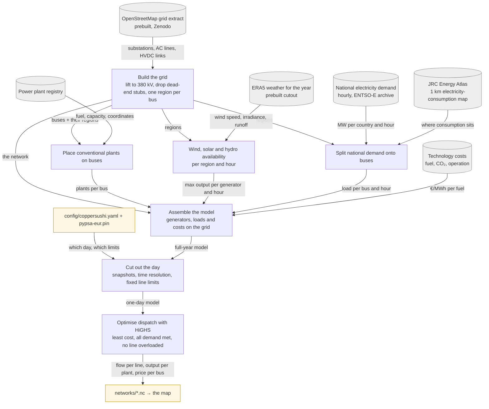

# PyPSA-Eur as a pinned sibling checkout

PyPSA-Eur runs from `../pypsa-eur`, a plain clone of **upstream** [PyPSA/pypsa-eur](https://github.com/PyPSA/pypsa-eur) (`origin`, fetching `master` only), pinned by `pypsa-eur.pin` in this repo. The [fork](https://github.com/zoltanmaric/pypsa-eur) is a second remote, `fork`, used only to push upstream-bound patch branches. Nothing of ours lives in that checkout: config, runner and any enhancement scripts are here.

## Why a sibling and a pin file

Needs: a versioned pin tying our config to the workflow code it targets; no vendoring; occasional upstream-bound patches; several agents in `worktrees/` at once; tens of GB of cutouts and results that must exist once. A submodule is checked out per worktree (a clone and a data directory per agent); a gitignored clone inside the repo is absent in worktrees; Snakemake's remote `module` fights a data-heavy workflow. The sibling with a pin file costs one hand-edited line per bump and satisfies everything else.

## How we configure and reuse it (planned)

- **`pypsa-eur.pin`**: two lines, `https://github.com/PyPSA/pypsa-eur.git` and a commit SHA. Bumping = editing the SHA and re-running.
- **Runner** (`pipeline/sources/pypsa_eur.py`): locates the sibling from git's common directory — the main checkout's parent, so it resolves identically from any worktree under `worktrees/` — overridable by `PYPSA_EUR_DIR`; reads the pin; refuses a dirty checkout; fetches and checks the pinned commit out detached; verifies HEAD equals the pin; runs `pixi run snakemake -call solve_elec_networks --configfile <abs path>/config/coppersushi.yaml`; copies `results/coppersushi/networks/base_s_all_elec_.nc` to `networks/opf-<day>.nc`, versioned with Git LFS. Slow steps narrate themselves (`narrate-slow-ops`).
- **`config/coppersushi.yaml`**: only what deviates from `config/config.default.yaml`, written against `config/schema.default.json`: `run.name`, `scenario` (`clusters: [all]`, `opts: [""]`), `snapshots` (one day), `countries`, `electricity.transmission_limit: v1.0`, empty `extendable_carriers`, `co2limit_enable: false`, `clustering.temporal.resolution_elec: 2h`, `solving.solver.name: highs` + `highs-default` with more threads, `transmission_losses: 0`, `noisy_costs: false`, `conventional.dynamic_fuel_price: false`. Upstream's `config/examples/config.validation.yaml` is *not* the template — it carries keys today's code ignores.
- **Data** stays in the sibling: `data/`, `cutouts/`, `resources/`, `results/`. Prebuilt cutout `europe-1940-2024-era5` and the osm-prebuilt grid are retrieved by upstream rules; nothing is fetched by us.
- **Environment**: pixi in the sibling (`pixi install`, `pixi shell`), upstream's preferred method.

## Dataflow: from raw data to the solved day

What PyPSA-Eur does with our config, in reader's terms (first run 2026-09-02: 56 rules, ~35 min of downloads and preprocessing; with Ukraine and Moldova 4390 buses, HiGHS 213 s for 12 snapshots). Edges name the data handed over; the table below maps each stage to upstream's rule names for anyone who needs the code.

| Stage | Upstream rules |
|---|---|
| Build the grid | `retrieve_osm_archive`, `build_shapes`, `base_network`, `add_transmission_projects_and_dlr`, `simplify_network`, `cluster_network` (`clusters: all`) |
| Place conventional plants | `retrieve_powerplants` (powerplantmatching), `build_powerplants` |
| Availability | `retrieve_cutout`, `determine_availability_matrix`, `build_renewable_profiles`, `build_hydro_profile` |
| Split demand | `retrieve_electricity_demand_*`, `retrieve_electricity_demand_energy_atlas`, `build_electricity_demand`, `build_electricity_demand_base` |
| Assemble | `retrieve_cost_data`, `add_electricity` → `base_s_all_elec.nc` |
| Cut out the day | `prepare_network` → `base_s_all_elec_.nc` |
| Optimise | `solve_network` → `results/coppersushi/networks/base_s_all_elec_.nc` |

Known traps, verified in upstream `563f22f6`: `clusters: all` is barely travelled upstream — three scripts assumed clustered bus names or clustered region sets and are patched on the pinned fork branch ([ledger](upstream-contributions.md)); a `powerplants_filter` on commissioning dates must be checked against the registry's date coverage or it silently empties the fleet; `transmission_limit: v1.01` makes every line extendable (`v1.0` keeps them fixed); `dynamic_fuel_price: true` gives all-NaN costs for a window not starting on a month boundary; `nuclear_p_max_pu.csv` ends 2024 and a later year raises `KeyError`; `highs-default` pins one thread; the Internet Archive copy of the 4 GB WDPA file (Ukraine/Moldova path) stalls at exactly 2 GiB on resumed downloads — `data.wdpa.source: primary` fetches the current month's file from the publisher instead. Ledger: [upstream-contributions](upstream-contributions.md).

## Fork refs (remote `fork`)

| Ref | Meaning |
|---|---|
| `master` | Pristine mirror of upstream. **Never commit here.** Sync: `git fetch origin && git merge --ff-only origin/master && git push fork master`. |
| topic branches | Only for patches bound upstream ([ledger](upstream-contributions.md)); pushed to `fork`, tested by pointing the pin at the branch commit. |
| `legacy-2022` | The old master (48 commits on PyPSA-Eur 0.5). Archive. |
| `coppersushi-v1` (tag) | The commit whose `config.yaml` produced v1's bundled network `elec_s_all_ec_lv1.01_2H.nc`. |
