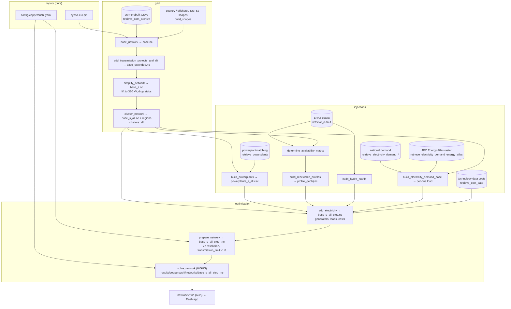

# PyPSA-Eur as a pinned sibling checkout

PyPSA-Eur runs from `../pypsa-eur`, a plain clone of **upstream** [PyPSA/pypsa-eur](https://github.com/PyPSA/pypsa-eur) (`origin`, fetching `master` only), pinned by `pypsa-eur.pin` in this repo. The [fork](https://github.com/zoltanmaric/pypsa-eur) is a second remote, `fork`, used only to push upstream-bound patch branches. Nothing of ours lives in that checkout: config, runner and any enhancement scripts are here.

## Why a sibling and a pin file

Needs: a versioned pin tying our config to the workflow code it targets; no vendoring; occasional upstream-bound patches; several agents in `worktrees/` at once; tens of GB of cutouts and results that must exist once. A submodule is checked out per worktree (a clone and a data directory per agent); a gitignored clone inside the repo is absent in worktrees; Snakemake's remote `module` fights a data-heavy workflow. The sibling with a pin file costs one hand-edited line per bump and satisfies everything else.

## How we configure and reuse it (planned)

- **`pypsa-eur.pin`**: two lines, `https://github.com/PyPSA/pypsa-eur.git` and a commit SHA. Bumping = editing the SHA and re-running.
- **Runner** (`pipeline/pypsa_eur.py`, planned): reads the pin; fetches; refuses a dirty checkout or a HEAD other than the pin; checks out detached; runs `pixi run snakemake -call solve_elec_networks --configfile <abs path>/config/coppersushi.yaml`; copies `results/coppersushi/networks/base_s_all_elec_.nc` into `networks/`. Slow steps narrate themselves (`narrate-slow-ops`).
- **`config/coppersushi.yaml`**: only what deviates from `config/config.default.yaml`, written against `config/schema.default.json`: `run.name`, `scenario` (`clusters: [all]`, `opts: [""]`), `snapshots` (one day), `countries`, `electricity.transmission_limit: v1.0`, empty `extendable_carriers`, `co2limit_enable: false`, `clustering.temporal.resolution_elec: 2h`, `solving.solver.name: highs` + `highs-default` with more threads, `transmission_losses: 0`, `noisy_costs: false`, `conventional.dynamic_fuel_price: false`. Upstream's `config/examples/config.validation.yaml` is *not* the template — it carries keys today's code ignores.
- **Data** stays in the sibling: `data/`, `cutouts/`, `resources/`, `results/`. Prebuilt cutout `europe-1940-2024-era5` and the osm-prebuilt grid are retrieved by upstream rules; nothing is fetched by us.
- **Environment**: pixi in the sibling (`pixi install`, `pixi shell`), upstream's preferred method.

## Target dataflow: from raw data to the solved OPF (planned topology, not implemented)

Upstream rules in order for the electricity-only path with the OSM grid; our inputs are the config and the pin, our output is the copied network. Every box is an upstream rule or file unless marked *ours*.

Known traps, verified in upstream `563f22f6`: `transmission_limit: v1.01` makes every line extendable (`v1.0` keeps them fixed); `dynamic_fuel_price: true` gives all-NaN costs for a window not starting on a month boundary; `nuclear_p_max_pu.csv` ends 2024 and a later year raises `KeyError`; `highs-default` pins one thread. Ledger: [upstream-contributions](upstream-contributions.md).

## Fork refs (remote `fork`)

| Ref | Meaning |
|---|---|
| `master` | Pristine mirror of upstream. **Never commit here.** Sync: `git fetch origin && git merge --ff-only origin/master && git push fork master`. |
| topic branches | Only for patches bound upstream ([ledger](upstream-contributions.md)); pushed to `fork`, tested by pointing the pin at the branch commit. |
| `legacy-2022` | The old master (48 commits on PyPSA-Eur 0.5). Archive. |
| `coppersushi-v1` (tag) | The commit whose `config.yaml` produced v1's bundled network `elec_s_all_ec_lv1.01_2H.nc`. |

## Refresh record (2026-09-02)

`legacy-2022` pushed; `master` force-pushed to upstream `563f22f6` (2026-08-28); 35 stale copies of upstream branches deleted (one, `344-missing-retreive-snakemake-keys-fn`, survived behind a protection rule and is left alone — its commit is upstream PR #374); locally the upstream repo is now `origin` (fetching `master` only) and the fork is `fork`. No 2022 commits carried: 41 of 46 conflict on files upstream deleted or restructured, the rest are trivia, and the code changes are obsolete or already in this repo.
