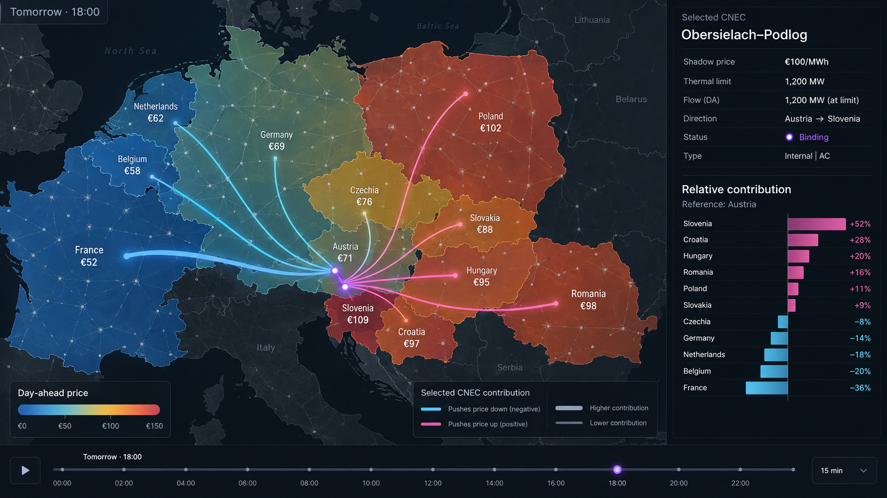

# Spec: CNEC price-influence map (burn-down)

Working memory for one product: put the Core day-ahead market's published zonal prices and
binding constraints in the same view, then let one constraint explain its share of the price
spreads. Background: [flow-based market coupling](../flow-based-market-coupling.md) and
[the Core capacity-calculation chain](../core-day-ahead-capacity-calculation.md).

The image is the visual target, not a data fixture: its prices, contributions and some cartography
are illustrative. The intended hierarchy is real — price remains the base layer, the selected
constraint is purple, and its signed influence reaches the affected zones without pretending to
trace the physical route of electricity.

## Problem

After the day-ahead auction, the ingredients that explain Core price separation are public but
disconnected. Price maps show the outcome; JAO's tables name the binding critical network elements
with contingencies (CNECs), their power transfer distribution factors (PTDFs) and shadow prices.
Neither makes the causal relationship visible.

For a selected market time unit, show the cleared outcome beside the active physical CNECs, then
isolate one row's contribution to the relative price pattern. A purple element means
**market-binding under its named contingency**, not physically overloaded in the intact or
real-time grid.

## Experience

- Colour each bidding zone by its published day-ahead price and label the price. The same value may
  colour every network node in the zone if the network remains the primary visual language.
- Draw active physical CNECs in purple; distinguish lines from transformer and phase-shifting
  transformer points. Hover identifies the monitored element, contingency, direction, remaining
  available margin and shadow price.
- Draw one physical PyPSA branch once. Its reachable marker aggregates every active direction and
  contingency, and every EIC that the matcher resolves to that branch; published rows keep their
  own source IDs for selection and analysis.
- Selecting one CNEC preserves the price layer and overlays its signed contribution across zones.
  Relative to an explicit reference zone `r`, the contribution to zone `z` is
  `-shadow_price * (PTDF_z - PTDF_r)`. Only differences are meaningful.
- Express that influence as restrained rays or a soft zone overlay. Do not route it along grid
  branches: JAO publishes zonal sensitivities to the selected CNEC, not the intervening power path.
- Support historical delivery days and the next delivery day once the cleared prices and JAO's
  active constraints have been published.

## Data

- **Domain and binding rows:** JAO's Core publication service. The final domain supplies monitored
  elements, contingencies, PTDFs, remaining available margin and identifiers; the post-auction
  Active flow-based publication supplies the binding rows and shadow prices. The existing JAO adapter and
  typed tables cover the historical `finalComputation` and `shadowPrices` feeds; recent publications
  need their present schema checked.
- **Prices:** published NEMO or ENTSO-E day-ahead prices. Electricity Maps' price `actual` route is a
  second adapter already verified across all twelve Core zones, including future cleared hours; see
  [Electricity Maps API](../electricity-maps-api.md).
- **Geometry:** JAO supplies element and substation identities but no coordinates. The matching work
  in [JAO's elements on the grid](jao-grid.md) locates them on the OpenStreetMap/PyPSA network and is
  the map's prerequisite.

No optimal power flow or reconstructed dispatch is required. Published prices provide the absolute
level; published shadow prices and PTDF differences provide each binding row's relative contribution.
JAO-derived records remain fetched locally rather than committed under JAO's terms.

## Not this product

- A forecast before market clearing.
- A reconstruction of actual or scheduled physical flows.
- Recursive PTDF propagation or an inferred path through unmonitored network branches.
- A claim that the selected element was physically overloaded.

## Later

- Complete the price-spread decomposition with active long-term-allocation, allocation and external
  constraints. They may become border or zone indicators or remain beside the map; none should be
  presented as a physical CNEC.
- A zone-pair explorer: “which constraints would more trade from A to B consume?”

## Acceptance

- [ ] One view can load a complete historical delivery day and a next-day result after publication,
      with a control for every available market time unit.
- [ ] Each interval shows published zonal prices and every mappable active flow-based CNEC; unmapped
      active flow-based CNECs remain visible and explicit.
- [ ] Selecting a CNEC shows an explicit reference zone and reproduces the published row's
      shadow-price-weighted PTDF difference for every Core zone, with sign and EUR/MWh units.
- [ ] The map and detail copy distinguish market binding under contingency from physical overload
      and distinguish the influence overlay from a power-flow path.
- [ ] No licensed JAO payload or authenticated Electricity Maps response is committed.
- [ ] Spec burned down, durable findings distilled, and this file deleted.

## Next

1. Render 2024-08-29 from the existing JAO tables and published prices, consuming the element
   mapping rather than expanding this spec into that work.
2. Check the current JAO active flow-based service contract and load the next published day through the same
   view.
