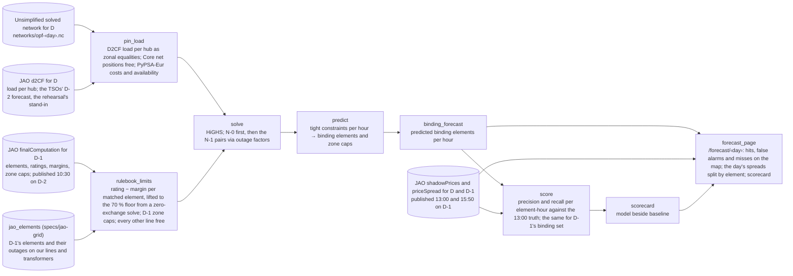

# Spec: Core congestion forecast (burn-down)

Working memory. Target: **Hack on the Grid** (Electricity Maps hackathon, Copenhagen, 2026-09-11), "Power markets" track. Domain: [copper-plate-problem](../copper-plate-problem.md). Background: [flow-based-market-coupling](../flow-based-market-coupling.md), [core-day-ahead-capacity-calculation](../core-day-ahead-capacity-calculation.md). Consumes [jao-grid](jao-grid.md)'s matched elements. Architecture: [sushi-2](../sushi-2.md).

## Problem

In Core, tomorrow's zonal price splits are the auction's binding constraints weighted by their PTDFs: the clearing problem's own arithmetic, reproduced on JAO's published numbers to the cent in ten hours of 2024-08-29 and within half in the rest ([flow-based-market-coupling](../flow-based-market-coupling.md)). The TSOs publish which elements *may* bind on day D at 10:30 on D-1; the auction decides which *do*, and JAO publishes them at 13:00. The claim: name day D's binding elements from **D-2 evening**, before the TSOs publish anything for D, with our nodal grid playing by the market's rulebook, and score against the 13:00 truth.

**One day, 2024-08-29**, the day [jao-grid](jao-grid.md) matches; the day is a parameter. It is the rehearsal: every input is public and complete, so the score isolates the model's foresight from forecast error. A 2026 day, then a future one, follow by swapping the zonal-forecast provider and nothing else.

**What the model may see at D-2 evening.** The domain published for D-1 (10:30 on D-2): the monitored elements, their ratings and reliability margins, the zone caps. D-1's binding set (13:00 on D-2), which is the baseline. The zonal forecast for D: in the rehearsal, JAO's D2CF page for D, the TSOs' own load per hub, made on D-2 and published only at 10:30 on D-1, so a stated stand-in for what a live run gets from Electricity Maps' 72-hour forecast. PyPSA-Eur's weather-driven availability for the day stands in for a renewables forecast the same way.

**The rulebook.** The market is blind by design, so the model must be too:

- Constraints only on the elements the TSOs monitored for D-1, matched to our lines and transformers by jao-grid. Every other line runs free.
- Each element's limit is the market's: rating minus reliability margin, lifted to the 70 % floor where the flow at zero Core exchange leaves less than 70 % of the rating for trade. The zero-exchange flow comes from our own solve with Core net positions fixed at zero, the TSOs' pre-final case. Dynamic ratings take D-1's value.
- D-1's zone caps as bounds on each zone's net position. Four of the day's seventeen binding constraints were caps, and no line model foresees those.
- Cost-based dispatch on PyPSA-Eur's costs as the bid proxy, load pinned per hub from D2CF, Core net positions free: the trade pattern is the thing being forecast.
- Binding rows are pairs, an element under an outage, for 105 of the 116 constraints of a sampled hour. The N-1 pairs enter as post-outage flow limits via outage factors, as jao-grid's `n-1` mode defines them; the first end-to-end run is N-0 so the loop closes.

## Dataflow

The JAO fetch is jao-grid's adapter with four more pages. Transforms exchange in-memory networks and frames.

## Approach

- **Scoring.** Per element-hour, predicted binding against JAO's 13:00 binding: precision and recall over the day's 13 elements and 4 zone caps across 23 hours. Beside it, the same numbers for the free baseline: D-1's binding set applied to D. The model earns its place where D differs from D-1, an outage, a rating change, a wind swing; the scorecard says by how much.
- **Prices without predicting prices.** The page splits each hour's published spreads into the binding elements' contributions, shadow price times PTDF difference, from JAO's numbers. That is the bridge from elements to prices; the shadow price *level* is not predicted, because it is the slope of bid curves the model does not have. Nor is a zone-pair rank correlation of spreads scored: 66 pairs carry twelve zones' worth of information, so a day's 0.29 clears no significance bar, and it would measure the levels we do not predict. The exchanges sell aggregated curves per zone under internal-use licences ([flow-based-market-coupling](../flow-based-market-coupling.md)), so calibrating costs to them is later work that can never commit the curves themselves.
- **Diagnostics, not criteria.** Our zero-exchange flow against JAO's `fref` per matched element, and our zone-to-element sensitivities against JAO's PTDFs, say where the grid or the dispatch is wrong when hits are bad.
- **Rejected.** Physics-only limits at 70 % of rating on every line, scored against the auction: they predict where physics overloads, the market is built not to see that, and the divergence is the thesis, not an error. Measured on this day ([backtest](../backtest-2024-08-29.md)): 45 to 80 lines at their cap per snapshot against JAO's 0 to 10, congestion placed in France where JAO had none, location rank correlation about zero through every cost variant. Nodal prices as predicted zonal prices: disconnected from zonal prices; the bridge is the identity above. A zonal LP on D-1's domain with cost curves as the baseline: a machine for one scorecard row, which D-1's binding set gives for free. A daily live loop with Electricity Maps forecasts on the 2013 proxy network: no matched elements to score against, two-hour steps, no cron worth running before the model works on one day.
- **Non-goals.** Zonal price and shadow-price levels; redispatch and the full-physics layer, where the market's schedule overloads what it cannot see; planned outages, remedial actions and phase-shifter optimisation; a daily capture; trading signals.

## Next steps

1. **Unsimplified 2024-08-29 solve** on the day's configuration (2024 weather cutout, dynamic fuel and carbon prices, 2025 cost vintage, duals assigned), jao-grid's step 1. Everything sits behind it.
2. **JAO fetch for the day**: the D-1 domain, D2CF for D, shadow prices for D and D-1, price spreads for D; committed JSON, hermetic test on a fixture of rows.
3. **Matching and the map**, jao-grid's steps 3 and 4.
4. **Rulebook solve, N-0**: D2CF load pinned, limits only on matched elements at rating minus margin, D-1 zone caps, Core net positions free. Then the 70 % lift from the zero-exchange solve, then the N-1 pairs.
5. **Score and page**: model beside baseline; hits, false alarms and misses on the map; spreads split by element.

## Acceptance criteria

- [ ] One command produces day D's predicted binding elements per hour from the D-1 domain, D-1's binding set and D2CF for D, and nothing published later than D2CF, in under an hour on the laptop.
- [ ] The same command prints precision and recall per element-hour for the model and for D-1's binding set, over the day's 13 binding elements and 4 zone caps.
- [ ] `/forecast/2024-08-29` colours the matched elements hit, false alarm or miss, lists the zone caps, splits the day's spreads by element from JAO's numbers, and shows the scorecard.
- [ ] Spec burned to nothing; findings distilled; this file deleted.

## Open

- How far D-1's element list and ratings differ from D's; the day measures it for free once both domains are fetched.
- Monitored elements jao-grid fails to match: invisible to the model, or a proxy limit.
- Whether D2CF load plus PyPSA-Eur's availability reproduces the TSOs' base case, read off the `fref` diagnostic.
- Generator outages: the model ran French nuclear 16 % above actual on the day ([backtest](../backtest-2024-08-29.md)), which moves the trade pattern the binding set depends on. ENTSO-E's unavailability data is public; the first accuracy lever once the loop closes.
- What the pinning interface needs from a live provider beyond load per hub: Electricity Maps' 72-hour forecast carries the mix by type, D2CF does not, and the trial key does not yet grant the mix forecast (review of this spec).
