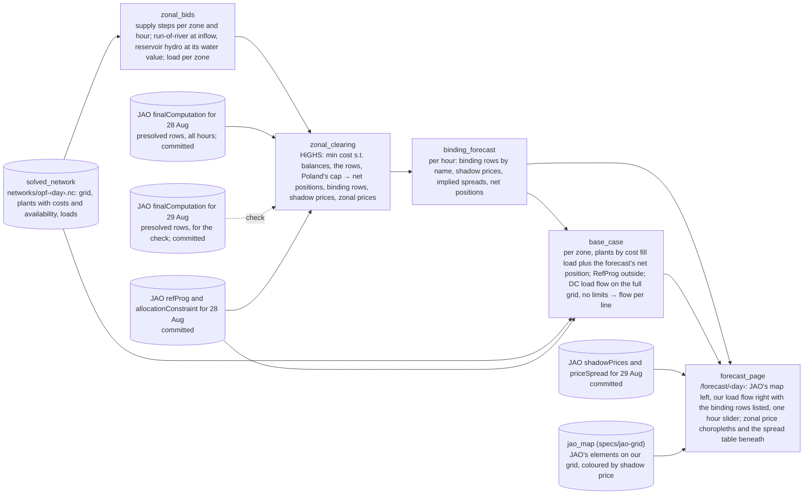

# Spec: Core congestion forecast (burn-down)

Working memory. Target: **Hack on the Grid** (Electricity Maps hackathon, Copenhagen, 2026-09-11), "Power markets" track. Domain: [copper-plate-problem](../copper-plate-problem.md). How the real thing works: [core-day-ahead-capacity-calculation](../core-day-ahead-capacity-calculation.md). Background: [flow-based-market-coupling](../flow-based-market-coupling.md). The left map and the JAO adapter are [jao-grid](jao-grid.md)'s. Architecture: [sushi-2](../sushi-2.md).

**Terms.** The vocabulary is [core-day-ahead-capacity-calculation](../core-day-ahead-capacity-calculation.md#vocabulary)'s, linked at first use. One word is this page's own. **Our base case**: a copper-plate dispatch of PyPSA-Eur's plants per zone at the forecast's net positions, and its DC load flow on the full grid; the solved network supplies the inputs, never its solution.

## Goal

For 29 August 2024, say which of the auction's constraints bind in each hour and what price differences they imply, using only what was public by the evening of 27 August. Show it on a page beside what JAO published at 13:00 on 28 August. Explain the difference. That is the whole deliverable: one day, one page, one explanation. No scoring, no baseline, no second day until this one has been read by eye.

The day is 29 August because [jao-grid](jao-grid.md) works on it; the day is a parameter. Every input is a stand-in for what a live run would have had on the evening of 27 August, drawn from what is public. A 2026 day is later work: PyPSA-Eur's data stack ends at 2024 as of 2026-09-08, and since June 2026 Core's borders to the outside enter the domain as virtual hubs, which changes the balances below.

## Inputs

- **28 August's constraints.** The [rows of the domain](../core-day-ahead-capacity-calculation.md#domain) that reached the auction for 28 August, about 120 per hour, published on 27 August at 10:30: for each, its [PTDF](../core-day-ahead-capacity-calculation.md#ptdf) per hub and its [RAM](../core-day-ahead-capacity-calculation.md#ram), the room it had left. Taken as they are, as if 29 August's grid were 28 August's.
- **28 August's exchanges with the outside**, per border, from [RefProg](../core-day-ahead-capacity-calculation.md#refprog), and its [allocation constraint](../core-day-ahead-capacity-calculation.md#allocation-constraint) on Poland.
- **PyPSA-Eur's network for 29 August** as inputs: the OpenStreetMap grid, the plants with their costs and the hour's availability, the loads. Its solution is not used: it is an optimal power flow with every line capped, and that dispatch already dodges the congestion the market cannot see.
- **The truth**, for the page only: JAO's shadow prices and price spreads for 29 August, published 28 August at 13:00 and 15:50.
- **29 August's own constraints**, for the check in step 3 only.

## The machine

One linear program per hour. Variables: each hub's net position, twelve zones and the two ALEGrO hubs, and each zone's output per supply step. The steps are PyPSA-Eur's generators grouped by zone and cost from the hourly cost series, carbon included, at the hour's availability; Luxembourg's buses fold into DE-LU. Run-of-river hydro runs at its inflow at zero cost. Reservoir hydro bids a water value per zone, the cost of the plant that would be marginal at the zone's average load that day, so it runs in the dear hours. Pumped storage is out of the first cut. Per zone, output minus load minus its RefProg exchange with the outside equals its net position, with a slack at the price cap so the program stays feasible. Every row holds, and the rows already carry the balances: two equality rows keep the fourteen hubs summing to zero, two keep the ALEGrO pair summing to zero, four external constraints hold each ALEGrO hub within ±1,000 MW. The cable's flow is therefore a decision variable the LP sets, as the auction does under Core's evolved flow-based treatment of ALEGrO; it reaches Belgium and Germany through the rows' PTDFs, and the zones' net positions already contain the exchange it carries: at 00:00 on 29 August JAO's net position for Belgium, −2,397.5 MW, is exactly its scheduled imports of 1,000 from Germany over the cable, 993.5 from France and 404 from the Netherlands. Poland's cap bounds its net position. Minimise cost.

Out come the net positions, the rows with a non-zero dual, which are the binding constraints, their duals, which are the shadow prices, and the zonal prices as the balances' duals. The implied price difference between two zones is the shadow prices times the PTDF differences, the identity checked on [flow-based-market-coupling](../flow-based-market-coupling.md). About 120 rows and a few hundred variables per hour; HiGHS solves it in well under a second. The network's snapshots are the market day's 24 hours, 22:00 UTC to 22:00 UTC, the same hours JAO publishes (jao-grid's hourly re-solve, PR #59), so nothing is mapped.

## Steps

1. **The constraints.** Extend jao-grid's adapter and tables (`coppersushi/jao.py`, `coppersushi/cnecs.py`, the first code layer of its stack, PR #58) with the PTDF column per hub and `ram` on the presolved rows of 28 and 29 August, every hour; the `refProg` and `allocationConstraint` pages for 28 August; `priceSpread` for 29 August. Presolved rows only, as plain CSV under `data/jao/‹day›/`, the way that stack commits them: about 2,600 rows and well under 2 MB a day, no LFS. The join between the domain and the shadow-price page is on hour, element EIC (energy identification code), direction and the contingency's branch EIC, never on the contingency string, whose format differs between the two feeds; the eight non-element rows carry `NA` as EIC and join by name. On 29 August hour and EIC alone are unique across the 78 binding element rows, but 17 of 72 presolved element-directions carry more than one contingency, so the full key is the rule.
2. **The bids.** From `networks/opf-2024-08-29.nc`: generators grouped by country with the hour's marginal cost (`generators_t.marginal_cost`; the static column is zero) and available capacity; run-of-river at inflow; reservoir hydro at its water value; load per country, Luxembourg into DE-LU.
3. **The check.** Clear our bids against 29 August's own rows, the constraints the market actually had. Whatever differs from 13:00 is the bids' doing, or the LP's omissions: the long-term domain and EUPHEMIA's block and complex orders. Printed, not on the page. If this is already far off, the forecast cannot be read.
4. **The forecast.** The same LP on 28 August's rows. Out: per hour, the binding constraints by name, their shadow prices, the zonal prices and the implied spreads, and each zone's net position.
5. **Our base case.** Inside each zone, plants by cost fill the load plus the forecast's net position, no line limits anywhere; the outside at RefProg; ALEGrO at the forecast's hub value. A DC load flow of that dispatch on the full grid gives the flow on every line. Nothing is capped and nothing is flagged: this is the physical picture of the forecast trade, the way the TSOs build their own base case from forecast schedules.
6. **The page.** Left: jao-grid's `/jao/‹day›` map, JAO's binding elements coloured by shadow price. Right: our grid with lines coloured by loading from step 5, as the app already draws a solved network, and the forecast's binding constraints listed by name with their shadow prices. One hour slider for both. Beneath: the twelve zones as a choropleth of the hour's price, ours beside JAO's, both relative to Germany because JAO publishes spreads and not levels, and the price differences as a table. Then the written account, with a screenshot of the page so a later session sees what was shown.

## Dataflow

The LP is linopy on HiGHS, already in the environment, with no PyPSA network in it; the base case is a PyPSA network with the dispatch written in and `lpf` run, which the app's existing map draws.

## Acceptance criteria

- [ ] One command produces, for 29 August, the check and the forecast, binding constraints with shadow prices and zonal prices per hour, and the base case's flow per line, from committed inputs.
- [ ] `/forecast/2024-08-29` shows JAO's binding elements on the left, our load flow and binding constraints on the right, one hour slider, and beneath them the zonal price choropleths, ours beside JAO's relative to Germany, and the spread table.
- [ ] A written explanation of what matches and what does not, on [backtest-2024-08-29](../backtest-2024-08-29.md) or a sibling page, with a screenshot of the page under `wiki/images/`.
- [ ] Spec burned to nothing; findings distilled; this file deleted.

## Later

Rebuilding 28 August's rows with our own flows: read the base case's flow on each matched element under its contingency, subtract 28 August's PTDFs times the forecast's net positions to get the flow with no Core exchange, recompute the margin lift and RAM by the verified identities, clear again. That is the nodal model's contribution to the forecast; it needs jao-grid's matching and is not in the hackathon cut. Also later: pumped storage in the bids; the full row list, since a row redundant on 28 August can bind on 29 August (19 of 108 in the sampled hour); our own PTDFs through a shift key.

## Non-goals

Scoring and baselines; more than one day; price levels as a claim; redispatch after the auction, remedial actions, outages; a live loop; trading signals.

## Open

- The long-term domain: EUPHEMIA clears on the union of the rows and the long-term allocations per border (JAO's `lta` page), so a rows-only LP is tighter than the market wherever the allocations reach beyond the rows, and a binding long-term facet never appears on the shadow-price page. Step 3 shows whether the day needed it.
- Transformers and phase shifters: until jao-grid's unsimplified network lands, our grid has none, so the right map cannot show their loading; 19 of the 116 presolved rows at the first hour are theirs.
