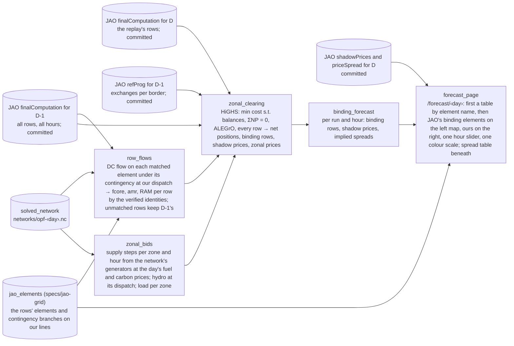

# Spec: Core congestion forecast (burn-down)

Working memory. Target: **Hack on the Grid** (Electricity Maps hackathon, Copenhagen, 2026-09-11), "Power markets" track. Domain: [copper-plate-problem](../copper-plate-problem.md). How the real thing works: [core-day-ahead-capacity-calculation](../core-day-ahead-capacity-calculation.md); "step n" below is that page's numbering. Background: [flow-based-market-coupling](../flow-based-market-coupling.md). Consumes [jao-grid](jao-grid.md)'s matched elements. Architecture: [sushi-2](../sushi-2.md).

## Goal

For one Core day, produce what we would have said at D-2 evening about which rows of the auction's domain bind in each hour and what price spreads they imply. Show it on a page beside what JAO published at 13:00 on D-1. Explain the difference. That is the whole deliverable: one day, one page, one explanation. No scoring, no baseline, no second day until this one has been read by eye.

The day is **2024-08-29**, the day [jao-grid](jao-grid.md) matches; the day is a parameter. It is a hindcast: every input is a stand-in for what a live run at D-2 evening would have, drawn from what is public, and named below. A 2026 day is later work: PyPSA-Eur's data stack ends at 2024 as of 2026-09-08, and since June 2026 Core's borders to the outside enter the domain as virtual hubs with PTDFs of their own, which changes the balances below.

## What the auction sees, and what we substitute

The auction clears the zones' bids against about 120 rows per hour of "PTDF · net positions ≤ RAM" (step 11). Everything about the grid enters through those rows. So the forecast is: rebuild the rows for D a day early, then clear a cost-based market against them.

| Step | The real input | Our stand-in at D-2 evening |
|---|---|---|
| 1 aligned net positions | D2CF, published 10:30 D-1 | our base case's net positions |
| 2, 3 grid models | never published | PyPSA-Eur's solved day: OSM grid, plant registry, weather-driven availability, the day's load, cost dispatch, hydro and pumped storage at that dispatch; no outages, no phase-shifter taps |
| 4 the list, ratings, margins, factors | published 10:30 D-1 | D-1's rows, published 10:30 D-2: the same list, fixed and seasonal ratings, `frm`, `minRamFactor`; dynamic ratings a day old |
| 5 PTDFs and base flows | published 10:30 D-1 | PTDFs: D-1's. Base flow per row: our grid's DC flow on the matched element under its contingency at our dispatch; `fcore` from it through D-1's PTDFs and our net positions. Rows we cannot match keep D-1's `fcore` |
| 6 remedial actions | published 10:30 D-1 | D-1's `fnrao` |
| 7 minimum margin | published 10:30 D-1 | `amr` recomputed by the verified identity from our `fall` and D-1's factor |
| 8, 9 long-term rights, validation | published 10:30 D-1 | D-1's columns |
| 10 RAM and presolve | published 10:30 D-1 | RAM by the verified identity; no presolve, the solver carries redundant rows |
| 11 bids | sold, never published | supply steps per zone from PyPSA-Eur's plants at the day's fuel and carbon prices; demand inelastic at the zone's load; exchanges with zones outside Core fixed per border from D-1's RefProg, JAO's `refProg` page |

## The machine

One linear program per hour. Variables: each hub's net position (twelve zones and the two ALEGrO hubs) and each zone's output per supply step, the steps being PyPSA-Eur's generators grouped by zone and cost from the hourly cost series, carbon included, at the hour's availability; hydro and pumped storage enter at the base case's dispatch as a zero-cost step; Luxembourg's buses fold into DE-LU. Per zone, output minus load minus its fixed exchange with non-Core zones equals its net position, with a slack at the price cap so the program stays feasible. Every row of the domain holds, and the domain already carries the balance rows: two equality rows keep the fourteen hubs' net positions summing to zero, two keep the ALEGrO pair summing to zero, and four external constraints hold each ALEGrO hub within ±1,000 MW. Minimise cost. Out come the net positions, the rows with a non-zero dual (the binding rows) and their duals (the shadow prices), and the zonal prices as the balances' duals. The implied spread between two zones is the shadow prices times the PTDF differences, the identity checked on [flow-based-market-coupling](../flow-based-market-coupling.md).

Three tables in, one out. In: the rows (per hour: identity, PTDFs, RAM), the bid steps (per zone and hour: capacity, cost), the non-Core exchanges (per border and hour, from RefProg). Out: per hour, binding rows with shadow prices, net positions, zonal prices. Some 11,500 rows and a few hundred variables per hour; HiGHS solves it in well under a second. Swap the rows table and the same program is a different run.

Hours: JAO's day runs 22:00 UTC to 22:00 UTC; the network holds twelve two-hour snapshots of the UTC day. Each snapshot's bids and flows serve its two hours, the first also serves the two hours before it, the last goes unused. An hourly re-solve on the CEST day is the fix if this shows in the result.

## Runs, in build order

1. **Replay.** The LP has two inputs, the rows and the bids. In the forecast both are ours, so a miss cannot be blamed on either. Replay runs the same LP on JAO's published rows for D with our bids. If replay matches 13:00, our bids are fine and any forecast miss is the grid's. If replay is already off, the bids are the problem before the grid enters. Same program, different table. It exists the moment the LP does, and on a live day it is a product by itself: at 10:30 it says what 13:00 will show.
2. **Yesterday's rows.** D-1's rows unchanged. Already a D-2 forecast, one that assumes the grid's constraints do not move overnight; needs no matching and no grid. The guaranteed deliverable.
3. **Yesterday's rows with our flows.** D-1's rows with `fcore`, `amr` and RAM rebuilt from our grid's flows on the matched elements. The nodal model's whole contribution. Run 2 is what it has to improve on; run 1 is its ceiling. Needs the matching, so it is the last thing on the day, if time remains.

The page comes in two forms. First a table, binding rows by JAO's element names, JAO's beside ours per hour, with the spread table: this needs no coordinates and shows runs 1 and 2 as soon as they exist. Then the two maps, which need the elements placed on our grid; the elements that bind on the day can be placed by hand first, as jao-grid allows.

## Dataflow

The JAO fetch is the adapter jao-grid plans; as of 2026-09-09 no JAO code exists in the repository, so step 1 writes it. Transforms exchange frames; the LP is linopy on HiGHS, already in the environment, with no PyPSA network in it.

## Next steps

1. **Fetch and commit the rows**: `finalComputation` and `refProg` for 2024-08-28 and 2024-08-29, every hour, and `shadowPrices` and `priceSpread` for 2024-08-29, under `data/jao/‹day›/`. About 280,000 rows a day: Parquet under Git LFS with only the columns the LP and the page need. Three repository edits come with it: the adapter joins the I/O allowlist in `tests/test_architecture.py`, `.gitignore` stops ignoring `data/jao/`, `.gitattributes` puts `data/jao/**/*.parquet` under LFS. The shadow-price page names things differently (`cnecName`, `hub_<zone>`, `f0core`), so the join to the rows is on EIC, contingency, direction and hour.
2. **Bids table** from `networks/opf-2024-08-29.nc`: generators grouped by country with the snapshot's marginal cost (`generators_t.marginal_cost`; the static column is zero) and available capacity; hydro and pumped storage at their dispatch; load per country, Luxembourg into DE-LU; snapshots mapped to JAO's hours as above.
3. **The LP, and run 1.** Binding rows and spreads next to 13:00, hour by hour, as the table page. This is where we learn whether cost bids are good enough for the grid to matter.
4. **Run 2.** Look again.
5. **Matching** (jao-grid's steps 3 and 4) for the elements in D-1's rows, by hand for the ones that bind, the row flows, **run 3**.
6. **The maps.**

## Acceptance criteria

- [ ] One command runs the three runs for 2024-08-29 from committed inputs and writes each run's binding rows, shadow prices, net positions and zonal prices per hour.
- [ ] `/forecast/2024-08-29` shows JAO's binding elements beside a chosen run's per hour, first as a table by element name, then as two maps with one hour slider and one colour scale, and the spread table beneath.
- [ ] A written explanation of what matches and what does not, per run, on [backtest-2024-08-29](../backtest-2024-08-29.md) or a sibling page.
- [ ] Spec burned to nothing; findings distilled; this file deleted.

## Non-goals

Scoring and baselines; more than one day; price levels as a claim; our own PTDFs through a shift key (D-1's serve for now); redispatch after the auction, remedial actions, outages; a live loop; trading signals.

## Open

- Our base case's exchanges with the outside are not usable in the balances: its Core net positions miss JAO's by about 2 GW per zone, with Ukraine and Moldova exporting 4 to 5 GW into PL, HU, SK and RO where RefProg has them importing, and France exporting to Switzerland where RefProg has the reverse. RefProg replaces them in the LP; run 3's row flows near those borders carry the same transit until the nodal solve pins its external borders.
- Our ALEGrO link sits at 1,000 MW in every snapshot; JAO's ALBE net position flips sign through the day. Run 3's `fcore` near Lixhe and Oberzier inherits that.
- Transformers and phase shifters: the simplified network has none (jao-grid's precondition), so their rows keep D-1's flows in run 3; 19 of the 116 presolved rows at the first hour.
- Whether run 3's `fcore` is better as a level or as a change: our flow for D minus our flow for D-1, added to D-1's `fcore`, cancels the grid model's bias but needs D-1 solved too.
- National caps on net positions live on JAO's `maxNetPos` page, outside the domain; none bound on the day. Rows to add if a day ever needs them.
