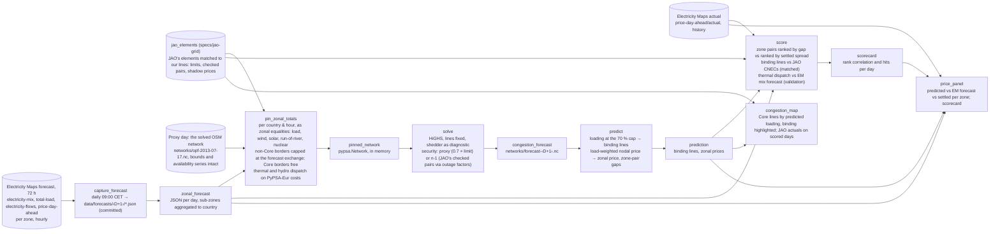

# Spec: Core congestion forecast (burn-down)

Working memory. Target: **Hack on the Grid** (Electricity Maps hackathon, Copenhagen, 2026-09-11), "Power markets" track. Domain: [copper-plate-problem](../copper-plate-problem.md). Architecture: [sushi-2](../sushi-2.md).

## Problem

In the Core flow-based region (AT, BE, CZ, DE, FR, HR, HU, NL, PL, RO, SI, SK) tomorrow's zonal price splits are decided by which grid elements bind. Two regional coordination centres compute that on a nodal model the TSOs supply piece by piece and then validate ([core-capacity-calculation](../core-capacity-calculation.md)). JAO publishes two things: the flow-based domain (critical elements with PTDFs and remaining margins, `finalComputation`) at about 10:30 CET on D-1, the constraint set handed to the auction; and, after the auction clears at 12:00, the shadow price per binding element (`shadowPrices`) at about 13:00. The claim here is the harder one: predict the binding elements **before 10:30, from the model alone**, using only Electricity Maps' 72-hour zonal forecasts pinned into our nodal optimal power flow. Lines at their limit are the predicted binding elements; the nodal price gaps are the predicted splits. Score every day against the 13:00 shadow prices and the settled prices; the 10:30 domain is a second benchmark (does the model's list match the non-redundant elements with the tightest margins?) and its `fref` column, the TSOs' base-case flow per element, checks our pinned base case directly.

The full product (planned outages, phase shifters, the TSOs' exact procedure, calibration to bidding) is months. The cut is the loop, running daily and honest about its hit rate: forecast → pin → solve → predict → score.

## Dataflow

External I/O stays in adapter modules: `electricity_maps` and `jao` join `networks` and `pypsa_eur` in the architecture test's allowlist. Transforms exchange in-memory networks and frames.

## Approach

- **Inputs**: Electricity Maps forecast endpoints, all granted on the trial key for every zone: per-source mix (MW), load, per-neighbour exchanges, and their own price forecast, 72 h hourly. Sub-zones (DK, IT, NO, SE) are summed to their country because buses carry a country, not a bidding zone; Luxembourg is grouped with Germany, since DE-LU is one bidding zone; with that, every Core zone is one group of buses. Captured daily from 2026-09-08 so that Friday has three scored days; the JSON is committed (`data/forecasts/` un-ignored, the rest of `data/` stays ignored) so the demo and the scorecard need no live call.
- **Truth and limits**: JAO's public `shadowPrices` (no key) names the binding critical network elements per hour with shadow price, remaining margin and limit; settled prices from Electricity Maps `price-day-ahead/actual`. The matching of JAO's elements to our lines, the true limits and the checked pairs come from [jao-grid](jao-grid.md), an independent task; until it lands, scoring is by zone-pair ranking only and the solve runs in `proxy` mode.
- **Network**: the solved 2013 OSM network is the proxy day. It keeps every bound and availability series, so it is re-pinned and re-solved; the OSM grid with fixed lines and the shedder is what the forecast must run on. (`opf-2013-07-17-v1.nc` is v1's 2022 solve on the old grid with extendable lines; not a proxy for anything.) The proxy supplies topology and the spatial pattern inside each zone; the pinned totals overwrite the rest. Its 12 two-hour snapshots take the hourly forecast averaged in pairs until a 2024 same-calendar-date run exists (better solar geometry; costs a PyPSA-Eur run). Rejected: a Snakemake run per forecast day (hours, and no 2026 weather cutout). Rejected: reproducing the TSOs' flow-based procedure (CNEC lists, reliability margins, minimum RAM, phase shifters, generation shift keys). The model predicts physics under the forecast dispatch, nothing more.
- **Pinning, and what stays free**: pinning everything would leave the LP nothing to decide, a power flow whose duals come from the shedder. So only the exogenous quantities are pinned, as zonal equalities per country and hour: load, wind, solar, run-of-river, and nuclear (inflexible, and French availability drives the French price). Thermal and reservoir hydro dispatch on PyPSA-Eur's costs, so the zonal balance duals are real prices. Exchanges: Core borders stay free, since the flow-based outcome is the thing being forecast; borders governed by a plain NTC (Spain–France runs as a 500–800 MW pipe on 2.8 GW of wire) are capped at the forecast exchange. The cost of this design: thermal dispatch is the model's merit order, not the forecast mix, and Electricity Maps' thermal forecast becomes a validation of the cost model rather than an input.
- **What counts as binding, two modes** (defined in [jao-grid](jao-grid.md)): `proxy` caps every line at 70 % of its thermal rating, PyPSA-Eur's stand-in for the N-1 margin, and a line at the cap is the model's analogue of an element with zero margin; `n-1` uses JAO's true limits and adds one constraint per (element, contingency) pair the TSOs check, so a binding pair is directly comparable to a JAO shadow price. Target is `n-1`; `proxy` runs until the pairs are matched.
- **Scoring, two levels**: the headline is zone pairs ranked by predicted price gap against the same pairs ranked by settled spread, a rank correlation per hour; ranking survives the level bias of cost-based prices by construction, where a euro threshold would not. The second level is binding lines against JAO's binding elements, which needs the matching from [jao-grid](jao-grid.md).
- **View**: the existing map with a forecast day, lines coloured by predicted loading, binding highlighted, JAO's actual binding elements overlaid on scored days; a panel with predicted, Electricity Maps forecast and settled zonal prices, and the scorecard.
- **Non-goals**: planned outages (ENTSO-E's API is down since early September; a slot in the dataflow, later), N-1 contingencies (PyPSA's security-constrained solve exists; stretch), calibration to bids, trading signals.

## Next steps

1. **Electricity Maps client and the daily capture** (today): forecast JSON for D+1 under `data/forecasts/`. Primary: a GitHub Actions cron at 09:00 CET with the key as a repository secret, pushing to a `forecasts` branch that a human merges. Fallback: the laptop.
2. **Pinning transform** on the solved OSM network, solve, predicted binding lines and zonal prices; unit test on the checked-in fixture.
3. **JAO client and scoring**, zone-pair ranking first.
4. **Map and panel**; three scored days by Friday; pitch.

## Acceptance criteria

- [ ] One command turns a captured forecast into predicted binding lines and zonal prices for D+1 in under 15 min.
- [ ] Forecast snapshots captured daily from 2026-09-08 without manual steps.
- [ ] Scorecard for at least three days: zone-pair rank correlation; binding lines vs JAO where matched; thermal dispatch vs forecast mix.
- [ ] The page shows tomorrow's Core map and the scorecard.
- [ ] Spec burned to nothing; findings distilled; this file deleted.

## Open

- Binding external constraints (caps on a zone's net position, also in `shadowPrices`) split prices without a line; the scorer must not count those hours as line congestion.
- A 2024 same-date proxy run, if the two-hour 2013 snapshots prove too coarse.
