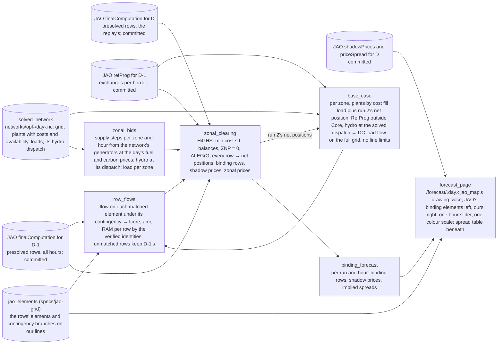

# Spec: Core congestion forecast (burn-down)

Working memory. Target: **Hack on the Grid** (Electricity Maps hackathon, Copenhagen, 2026-09-11), "Power markets" track. Domain: [copper-plate-problem](../copper-plate-problem.md). How the real thing works: [core-day-ahead-capacity-calculation](../core-day-ahead-capacity-calculation.md); "step n" below is that page's numbering. Background: [flow-based-market-coupling](../flow-based-market-coupling.md). Consumes [jao-grid](jao-grid.md)'s matched elements. Architecture: [sushi-2](../sushi-2.md).

**Terms.** The vocabulary is [core-day-ahead-capacity-calculation](../core-day-ahead-capacity-calculation.md#vocabulary)'s, linked at first use. Two words are this page's own. **Our base case**: a copper-plate dispatch of PyPSA-Eur's plants per zone at run 2's net positions and its DC load flow on the full grid; the solved network supplies the inputs, not its solution. **Matched**: said of an element of JAO's rows that jao-grid has placed on one of our lines or transformers.

## Goal

For one Core day, produce what we would have said at D-2 evening about which [rows of the auction's domain](../core-day-ahead-capacity-calculation.md#domain) bind in each hour and what price spreads they imply. Show it on a page beside what JAO published at 13:00 on D-1. Explain the difference. That is the whole deliverable: one day, one page, one explanation. No scoring, no baseline, no second day until this one has been read by eye.

The day is **2024-08-29**, the day [jao-grid](jao-grid.md) matches; the day is a parameter. It is a hindcast: every input is a stand-in for what a live run at D-2 evening would have, drawn from what is public, and named below. A 2026 day is later work: PyPSA-Eur's data stack ends at 2024 as of 2026-09-08, and since June 2026 Core's borders to the outside enter the domain as virtual hubs with PTDFs of their own, which changes the balances below.

## What the auction sees, and what we substitute

The auction clears the zones' bids against about 120 rows per hour, one grid element under one assumed outage each, reading "[PTDF](../core-day-ahead-capacity-calculation.md#ptdf) · net positions ≤ [RAM](../core-day-ahead-capacity-calculation.md#ram)": power transfer distribution factors times net positions within the remaining available margin (step 11). Everything about the grid enters through those rows. So the forecast is: rebuild the rows for D a day early, then clear a cost-based market against them.

| Step | The real input | Our stand-in at D-2 evening |
|---|---|---|
| 1 aligned net positions | [D2CF, the D-2 congestion forecast](../core-day-ahead-capacity-calculation.md#d2cf), published 10:30 D-1 | run 2's net positions: our zonal clearing on D-1's rows, a market forecast that respects the domain, as the alignment does |
| 2, 3 grid models | never published | PyPSA-Eur's network as inputs, not its solve: OpenStreetMap grid, plant registry with costs and weather-driven availability, the day's load; hydro and pumped storage at the solved network's dispatch; no outages, no phase-shifter taps |
| 4 the list, ratings, margins, factors | published 10:30 D-1 | D-1's rows, published 10:30 D-2: the same list, fixed and seasonal ratings, `frm`, `minRamFactor`; dynamic ratings a day old |
| 5 PTDFs and base flows | published 10:30 D-1 | PTDFs: D-1's. Base flow per row: a DC load flow of our base case on the full grid, no line limits, read on the matched element under its contingency; [`fcore`](../core-day-ahead-capacity-calculation.md#one-row-of-the-domain) from it by subtracting D-1's PTDFs times run 2's net positions. Rows we cannot match keep D-1's `fcore` |
| 6 remedial actions | published 10:30 D-1 | D-1's `fnrao` |
| 7 minimum margin | published 10:30 D-1 | `amr` recomputed by the verified identity from our `fcore` and D-1's `minRamTarget` |
| 8, 9 long-term rights, validation | published 10:30 D-1 | D-1's `fltn` and validation columns; the long-term domain not modelled, see Open |
| 10 RAM and presolve | published 10:30 D-1 | RAM by the verified identity on D-1's presolved rows, the candidate set; the full list is a later refinement |
| 11 bids | sold, never published | supply steps per zone from PyPSA-Eur's plants at the day's fuel and carbon prices; demand inelastic at the zone's load; exchanges with zones outside Core fixed per border from D-1's [RefProg, the reference programme](../core-day-ahead-capacity-calculation.md#refprog), JAO's `refProg` page |

## The machine

One linear program per hour. Variables: each hub's net position (twelve zones and the two ALEGrO hubs) and each zone's output per supply step, the steps being PyPSA-Eur's generators grouped by zone and cost from the hourly cost series, carbon included, at the hour's availability; hydro and pumped storage enter at the solved network's dispatch as a zero-cost step; Luxembourg's buses fold into DE-LU. Per zone, output minus load minus its fixed exchange with non-Core zones equals its net position, with a slack at the price cap so the program stays feasible. Every row of the domain holds, and the domain already carries the balance rows: two equality rows keep the fourteen hubs' net positions summing to zero, two keep the ALEGrO pair summing to zero, and four external constraints hold each ALEGrO hub within ±1,000 MW. The cable's flow is therefore a decision variable the LP sets to maximise welfare, as the auction does under Core's evolved flow-based treatment of ALEGrO; it reaches Belgium and Germany through the rows' PTDFs, and the zones' own net positions already contain the exchange it carries: at 00:00 on 2024-08-29 JAO's net position for Belgium, −2,397.5 MW, is exactly its scheduled imports of 1,000 from Germany over the cable, 993.5 from France and 404 from the Netherlands, and Germany's 3,423 likewise includes its 1,000 export. Adding the hubs to the balances would count the cable twice. Poland's and Belgium's caps from JAO's `allocationConstraint` page bound their net positions; Poland's was set every hour of the day. Minimise cost. Out come the net positions, the rows with a non-zero dual (the binding rows) and their duals (the shadow prices), and the zonal prices as the balances' duals. The implied spread between two zones is the shadow prices times the PTDF differences, the identity checked on [flow-based-market-coupling](../flow-based-market-coupling.md).

Three tables in, one out. In: the rows (per hour: identity, PTDFs, RAM), the bid steps (per zone and hour: capacity, cost), the non-Core exchanges (per border and hour, from RefProg). Out: per hour, binding rows with shadow prices, net positions, zonal prices. About 120 rows and a few hundred variables per hour; HiGHS solves it in well under a second. Swap the rows table and the same program is a different run.

Hours: the network's snapshots are the market day's 24 hours, 22:00 UTC to 22:00 UTC, the same hours JAO publishes (jao-grid's hourly re-solve, PR #59), so nothing is mapped.

## Runs, in build order

1. **Replay.** The LP has two inputs, the rows and the bids. In the forecast both are ours, so a miss cannot be blamed on either. Replay runs the same LP on JAO's published rows for D with our bids. Whatever differs from 13:00 is the bids' doing, or the LP's omissions: the long-term domain and EUPHEMIA's block and complex orders. If replay matches 13:00, any forecast miss is the grid's; if replay is already off, the bids or the omissions are the problem before the grid enters. Same program, different table. It exists the moment the LP does, and on a live day it is a product by itself: at 10:30 it says what 13:00 will show.
2. **Yesterday's rows.** D-1's rows unchanged. Already a D-2 forecast, one that assumes the grid's constraints do not move overnight; needs no matching and no grid. The guaranteed deliverable.
3. **Yesterday's rows with our flows.** D-1's rows with `fcore`, `amr` and RAM rebuilt from our base case's flows on the matched elements: a copper-plate dispatch at run 2's net positions and its load flow, so run 3 follows run 2. The nodal model's whole contribution. Run 2 is what it has to improve on; run 1 is the best it can do, short of what the LP omits. Needs the matching, so it is the last thing on the day, if time remains.

The page is two maps: jao-grid's `/jao/‹day›` drawing, elements coloured by shadow price, drawn twice with one hour slider and one colour scale, JAO's shadow prices on the left and a run's on the right, the spread table beneath. It needs the elements placed on our grid, which is jao-grid's matching; the LP and runs 1 and 2 need only its data layer and proceed in parallel.

## Dataflow

The JAO fetch is jao-grid's adapter, `coppersushi/jao.py` with the tidy tables in `coppersushi/cnecs.py` (the first code layer of its stack, planned in PR #58), extended with the columns and pages the LP needs. Transforms exchange frames; the LP is linopy on HiGHS, already in the environment, with no PyPSA network in it.

## Next steps

1. **Extend jao-grid's adapter and tables** with what the LP needs: the PTDF column per hub, `fcore`, `fall`, `fuaf`, `amr`, `minRamTarget`, `fltn`, `iva` and `ram` on the presolved rows of 2024-08-28 and 2024-08-29, every hour; the `refProg` and `allocationConstraint` pages for both days; `priceSpread` for 2024-08-29. Presolved rows only, as plain CSV under `data/jao/‹day›/`, the way that stack commits them: about 2,600 rows and well under 2 MB a day, no LFS. The full list of some 11,500 rows an hour is a later refinement, since a row redundant on D-1 can bind on D (19 of 108 in the sampled hour). The join between the domain and the shadow-price page is on hour, element EIC (energy identification code), direction and the contingency's branch EIC, never on the contingency string, whose format differs between the two feeds; the eight non-element rows carry `NA` as EIC and join by name. On 2024-08-29 hour and EIC alone are unique across the 78 binding element rows, but 17 of 72 presolved element-directions carry more than one contingency, so the full key is the rule.
2. **Bids table** from `networks/opf-2024-08-29.nc`: generators grouped by country with the hour's marginal cost (`generators_t.marginal_cost`; the static column is zero) and available capacity; hydro and pumped storage at their dispatch; load per country, Luxembourg into DE-LU.
3. **The LP, and run 1.** Binding rows and spreads next to 13:00, hour by hour. This is where we learn whether cost bids are good enough for the grid to matter.
4. **Run 2.** Look again.
5. **The base case**: copper-plate dispatch at run 2's net positions, its load flow, the row flows on the elements jao-grid has matched, **run 3**.
6. **The page**: jao-grid's map drawn twice.

## Acceptance criteria

- [ ] One command runs the three runs for 2024-08-29 from committed inputs and writes each run's binding rows, shadow prices, net positions and zonal prices per hour.
- [ ] `/forecast/2024-08-29` shows two maps with one hour slider and one colour scale, JAO's binding elements on the left, a chosen run's on the right, and the spread table beneath; the drawing is jao-grid's `/jao/‹day›` map.
- [ ] A written explanation of what matches and what does not, per run, on [backtest-2024-08-29](../backtest-2024-08-29.md) or a sibling page.
- [ ] Spec burned to nothing; findings distilled; this file deleted.

## Non-goals

Scoring and baselines; more than one day; price levels as a claim; our own PTDFs through a shift key (D-1's serve for now); redispatch after the auction, remedial actions, outages; a live loop; trading signals.

## Open

- Transformers and phase shifters: until jao-grid's unsimplified network lands, ours has none, so their rows keep D-1's flows in run 3; 19 of the 116 presolved rows at the first hour.
- Whether run 3's `fcore` is better as a level or as a change: our flow for D minus our flow for D-1, added to D-1's `fcore`, cancels the grid model's bias but needs D-1's base case too.
- The long-term domain: EUPHEMIA clears on the union of the rows and the long-term allocations per border (JAO's `lta` page), so a rows-only LP is tighter than the market wherever the allocations reach beyond the rows, and a binding long-term facet never appears on the shadow-price page. Run 1 shows whether the day needed it.
