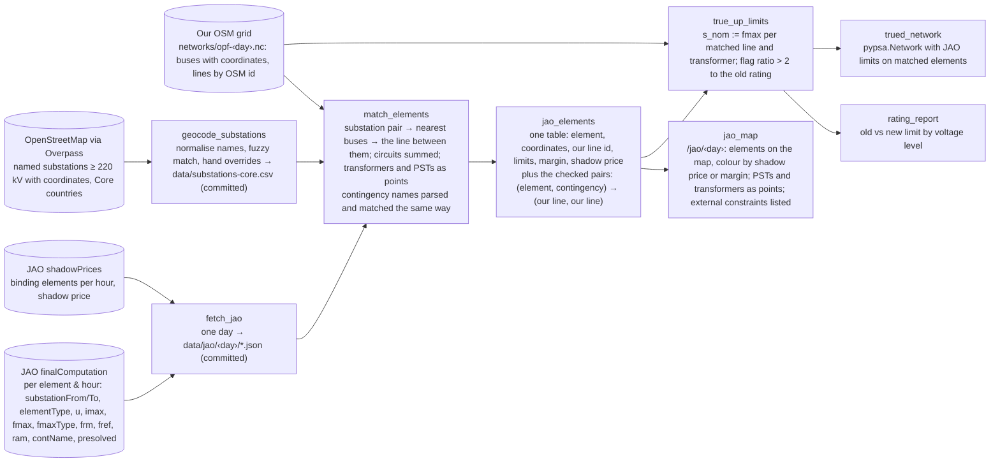

# Spec: JAO's elements on the grid (burn-down)

Working memory. An independent task: it needs nothing from the optimal power flow and can run in parallel with [core-congestion-forecast](core-congestion-forecast.md), which consumes its two outputs. Background: [flow-based-market-coupling](../flow-based-market-coupling.md).

## Problem

JAO publishes, for every hour, the grid elements that limit trade in the Core region: which line or transformer, between which two substations, its limit in MW, how much room it had, and, after the auction, whether it bound and at what shadow price. It publishes all of this as tables. Nobody draws it on a map, because the tables carry substation names and no coordinates. Our OSM-based grid has the coordinates and no names, and its line and transformer limits are guesses: a standard conductor rating per voltage level, and 2000 MVA for every transformer where the real Austrian 380/220 kV units are rated 555 to 607 MW.

Two deliverables from one piece of matching work:

1. **A map page** showing JAO's elements on the real grid for a chosen day: the truth layer the forecast is scored against, and a demo on its own.
2. **True limits** for the matched lines and transformers, written into our network from JAO's own numbers.

## Dataflow

`jao` is an adapter module (external I/O) and joins the architecture test's allowlist; the Overpass fetch is a one-off that lands as a committed CSV.

## Approach

- **JAO's data is richer than its names suggest.** `finalComputation` rows carry `substationFrom` and `substationTo` as separate fields, an EIC code, the element type (Line, TieLine, Transformer, PST), the voltage, and the limit with its type (fixed, seasonal, dynamic). No parsing of names like "Y-Altheim (-Simbach - St. Peter) 234/230" is needed. Sizes on 2026-09-07: about 900 distinct lines and 62 transformers monitored per hour, 170 of them non-redundant (`presolved`), 39 distinct elements binding over the day. Both endpoints are public, no key: `https://publicationtool.jao.eu/core/api/data/{finalComputation,shadowPrices}?FromUtc=…&ToUtc=…`.
- **Coordinates come from OpenStreetMap, not from PyPSA-Eur.** The sibling's OSM extract keeps only ids in its tags column. An Overpass query for `power=substation` with a name and a voltage of 220 kV or more, one per Core country, returns the named substations with centroids; a test over the Low Countries found Maasbracht, Siersdorf, Zandvliet and Avelgem at once. Matching: lowercase, strip prefixes like "Umspannwerk", "Station", "380 kV", strip diacritics and trailing circuit numbers, then fuzzy match. Expect most to match automatically; the elements that bind on the sample days are fixed by hand in an override column, since those are the ones on screen.
- **From substations to our lines.** Each matched pair gives two coordinates; the nearest buses in our network and the line joining them is the element. JAO lists parallel circuits separately ("Duernrohr 1 - Slavetice 437" and "438"); our network folds them into one line with a circuit count, so as a *monitored element* their limits are summed. As a *contingency*, one circuit out of k is not the corridor out: the folded line's reactance rises by k/(k−1) and the outage factor is computed for that reactance change, not for a removal. Only a contingency naming every circuit removes the line. Transformers and phase shifters sit inside one substation and are drawn as points. External constraints (caps on a zone's net position) have no location and are listed beside the map.
- **True-up rule, two modes.** For a matched line, the thermal limit becomes JAO's fmax (circuits summed); transformers, once the unsimplified network is in use, take fmax in place of the 2000 MVA default. What sits on top of fmax is a switch:
  - **`proxy`**: limit = 0.7 × fmax, no contingencies. PyPSA-Eur's stand-in for N-1 security, kept until the pairs are matched. The default on day one.
  - **`n-1`**: limit = fmax in the base case, and for every (element, contingency) pair JAO checks, the post-outage flow must stay under fmax − margin, where the margin defaults to JAO's frm (10 % of fmax at the median). The margin is deliberately *not* part of the true-up: the equipment limit written into the network is fmax. It enters only in the solve, as a parameter, because the purpose here is to predict where the *market* binds, and the auction clears against fmax − frm, not against fmax. A physical security study sets the margin to zero. Post-outage flow is base flow plus the outage's flow times a line outage distribution factor, computed once from the network's PTDF matrix. On 2026-09-07 that is 9,243 pairs per hour, about 110,000 linear rows for a 12-snapshot day: a small addition to the LP, and HiGHS does not notice. PyPSA's built-in security-constrained solve is *not* the tool: it checks every line under every outage, 946 × 7371 per snapshot here, about 84 million rows. The pairs are the TSOs' own selection and the whole point.
  - The target is `n-1`. Its extra cost over `proxy` is matching the contingencies, whose names are free text ("Pasewalk - Bertikow 408", the structured field is empty) and go through the same substation geocoding as the elements.
- **Dynamic ratings and timing.** About half of JAO's limits are dynamic, changing hour by hour, and tomorrow's are published at 10:30 on D-1, the moment the forecast wants to beat. So a forecast run uses yesterday's or the seasonal ratings; the scoring run uses the real ones. The true-up therefore writes a per-hour `s_max_pu` where the rating is dynamic, and a scalar where it is fixed.
- **Coverage.** Monitored elements only: roughly a third of Core's lines, none outside Core. The rest keep their standard rating. The monitored ones are by definition the ones that can bind.
- **Free by-product.** The rating report, old versus new limit per voltage level, says how wrong OSM-derived ratings are. A systematic bias is a finding for PyPSA-Eur; the [upstream ledger](../upstream-contributions.md) has the slot.
- **Non-goals**: modelling phase-shifter behaviour, anything outside Core, and the TSOs' remedial actions after the auction.

## Next steps

1. **`coppersushi.jao`**: fetch a day of both endpoints into committed JSON; a hermetic test on a small fixture of rows.
2. **Substation geocoding**: Overpass per Core country, the normalisation, the override column; committed CSV with the OSM ids as provenance.
3. **Element matching** and the map page for one sample day (2026-09-07 has the row counts above).
4. **True-up transform** with the ratio flag and the rating report.

## Acceptance criteria

- [ ] One command fetches a day from JAO into `data/jao/<day>/` and builds the element table.
- [ ] At least 90 % of the substations named in that day's non-redundant elements are geocoded; every element that bound that day is matched, by hand if needed.
- [ ] `/jao/<day>` draws the matched elements coloured by shadow price when binding and by margin otherwise, transformers and PSTs as points, external constraints listed.
- [ ] `true_up_limits` writes JAO limits onto matched lines, sums circuits, writes hourly `s_max_pu` for dynamic ratings, and flags every match whose new limit differs from the old by more than a factor of two.
- [ ] The checked pairs are matched for the non-redundant elements of the sample day, and a `security='n-1'` solve on the trued network runs on the checked-in fixture with the pair constraints active.
- [ ] The rating report exists for one day.
- [ ] Spec burned to nothing; findings distilled; this file deleted.

## Open

- Whether Overpass name coverage is good enough in Czechia, Slovakia, Hungary, Romania and Poland, where diacritics and local naming differ most from JAO's ASCII names.
- Whether the JAO page shows one hour or the day's binding set at once.
- How many contingency names resist parsing; a hand override column covers the non-redundant ones.
