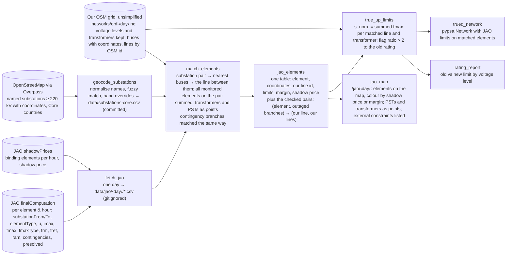

# Spec: JAO's elements on the grid (burn-down)

Working memory. An independent task: it needs nothing from the optimal power flow and can run in parallel with [core-congestion-forecast](core-congestion-forecast.md), which consumes its two outputs. Background: [flow-based-market-coupling](../flow-based-market-coupling.md).

## Problem

JAO publishes, for every hour, the grid elements that limit trade in the Core region: which line or transformer, between which two substations, its limit in MW, how much room it had, and, after the auction, whether it bound and at what shadow price. It publishes all of this as tables. Nobody draws it on a map, because the tables carry substation names and no coordinates. Our OSM-based grid has the coordinates and no names, and its line limits are guesses: a standard conductor rating per voltage level.

**Precondition: skip PyPSA-Eur's network simplification.** This is not a detail of the true-up, it is the gate the whole spec sits behind: `simplify_network_to_380` deletes every transformer, JAO monitors about 62 transformers and PSTs per hour (on 2024-08-29 one transformer, Rosiori 400/220, bound for ten hours), and a monitored element with no branch in our network cannot be matched, cannot carry a limit, and cannot be predicted to bind — so on the simplified network an entire class of CNEC is not merely approximated, it is absent. Nothing else in this spec can start until the network keeps its transformers.

PyPSA-Eur lifts everything to one 380 kV layer before we ever see it (`simplify_network_to_380` at `scripts/simplify_network.py:439`, called unconditionally — there is no config switch, and the pinned fork does not patch it). The solved network as of 2026-09-08: 4,390 buses and 7,371 lines, all `v_nom = 380`, **zero transformers**, down from `base.nc`'s 6,863 buses, 9,162 lines and 878 transformers across eight voltage levels. What the lift costs, measured:

- **Lines survive the lift almost intact.** Capacity is exact: `num_parallel = s_nom / (√3 · 380 · i_nom)` absorbs the voltage change into a fractional circuit count (ours run 0.29 to 4.21) and `s_nom` is unchanged, so JAO's fmax is directly comparable whatever voltage the element is at. Reactance is nearly exact: with the 380 kV line type and that `num_parallel`, per-unit reactance lands within 5–10 % of the original (220 kV: 0.946 of true, 275 kV: 0.896, 400 kV: 1.053, 380 kV: 1.000 by construction). And identity survives: line ids keep their original voltage as a suffix — `way/1034408962-220` is a 220 kV corridor, and 1,736 of our lines are 220 kV, median `s_nom` 492 MW. Nothing about a lower-voltage line is lost except its label.
- **Corridors are not merged.** 6,221 distinct bus pairs carry 7,371 lines; 931 pairs carry more than one, up to eight. A 220 kV corridor and a 380 kV corridor between the same substations remain two lines, distinguishable by their ids. What *is* folded is parallel circuits on one tower: OSM's `circuits=2` becomes one line with `num_parallel = 2` (2,396 such in `base.nc`).
- **Transformers do not.** All 878 are deleted, each low-voltage bus collapsed into the high-voltage one at the same site. This is the one loss that no amount of care in the matching can work around, and the reason for the precondition above. Their PyPSA-Eur ratings are not worth keeping either — OSM-derived `s_nom` from 503 to 23,238 MVA, median 4,425, with a flat `x = 0.1` p.u. for every one of them, against real Austrian 380/220 kV units at 555 to 607 MW — which is the point: an unsimplified network without JAO is a network of guessed transformers, and JAO's fmax is what makes keeping them worth the trouble.
- **What skipping costs.** `simplify_network` also emits `busmap_base_s.csv` and the two `regions_*_base_s.geojson` that `add_electricity` needs, so the rule cannot simply be dropped from the DAG: either fork the script and keep everything but the 380 kV lift, or supply an identity busmap and re-cut the regions for 6,863 buses. Forking is the honest route and about 40 lines, at the cost of a patched script against a moving pin; a `to_380` config flag is the version that belongs upstream, and the [ledger](../upstream-contributions.md) has the slot. `cluster_network` is already a no-op under `clusters: all` (`base_s`, `base_s_all` and `base_s_all_elec` are all 4,390 buses), so simplification is the only reducing step to undo.

**Scope: one day, 2024-08-29.** The shelf holds it simplified, without transformers; step 1 re-solves it unsimplified. Everything below is built and accepted for that day alone. If a sweep over a longer range turns out to be needed to synthesise anything, that is a later, separate decision.

Two deliverables from one piece of matching work:

1. **A map page** showing JAO's elements on the real grid for that day: the truth layer the forecast is scored against, and a demo on its own.
2. **True limits** for the matched lines *and transformers*, written into our network from JAO's own numbers — the transformers being the reason the network has to keep its voltage levels at all.

## Dataflow

The JAO fetch is an adapter (external I/O) and joins the architecture test's allowlist; the Overpass fetch is a one-off that lands as a committed CSV.

## Approach

- **JAO's data is richer than its names suggest.** `finalComputation` rows carry `substationFrom` and `substationTo` as separate fields, an EIC code, the element type (Line, TieLine, Transformer, PST), the voltage, and the limit with its type (fixed, seasonal, dynamic). No parsing of names like "Y-Altheim (-Simbach - St. Peter) 234/230" is needed, and the contingency comes the same way: a `contingencies` list, one entry per outaged branch with its substations, beside the free-text `contName`. Sizes on a sampled day: about 900 distinct lines and 62 transformers monitored per hour, 170 of them non-redundant (`presolved`), 39 distinct elements binding over the day. On 2024-08-29: 116 presolved rows at hour 0 (67 tie-lines, 22 lines, 13 PSTs, 6 transformers, the four ALEGrO limits with PTDF ±1 on the two virtual hubs, and four equality constraints), 13 distinct elements and the four ALEGrO limits binding over the day; no national net-position cap bound. Both endpoints are public, no key: `https://publicationtool.jao.eu/core/api/data/{finalComputation,shadowPrices}?FromUtc=…&ToUtc=…`.
- **Coordinates come from OpenStreetMap, not from PyPSA-Eur.** The sibling's OSM extract keeps only ids in its tags column. An Overpass query for `power=substation` with a name and a voltage of 220 kV or more, one per Core country, returns the named substations with centroids; a test over the Low Countries found Maasbracht, Siersdorf, Zandvliet and Avelgem at once. Matching: lowercase, strip prefixes like "Umspannwerk", "Station", "380 kV", strip diacritics and trailing circuit numbers, then fuzzy match. Expect most to match automatically; the elements that bind on the day are fixed by hand in an override column, since those are the ones on screen.
- **From substations to our lines.** Each matched pair gives two coordinates; the nearest buses in our network and the line joining them is the element. JAO lists parallel circuits separately ("Duernrohr 1 - Slavetice 437" and "438"); where those are circuits of one corridor our network folds them into a single line with a circuit count, so their limits are summed. The sum runs over the elements that land on the *same* line, not over everything on the substation pair: where the pair carries several of our lines, the JAO element's voltage picks which one, against the voltage suffix in the line id. As a *contingency*, one circuit out of k is not the corridor out: the folded line's reactance rises by k/(k−1) and the outage factor is computed for that reactance change, not for a removal. Only a contingency naming every circuit removes the line. Transformers and phase shifters sit inside one substation and are drawn as points; on the unsimplified network each is a branch between that site's two voltage buses, so its JAO limit is written like any line's. External constraints (caps on a zone's net position) have no location and are listed beside the map.
- **Security: what a limit means, and which version we build.** For a matched line the equipment limit becomes JAO's fmax (all monitored elements on the pair summed). What keeps the solve inside N-1 on top of that limit has two versions:
  - **Status quo, `proxy`** — what PyPSA-Eur does as of 2026-09-08: every line capped at 0.7 × fmax, no contingencies at all. A flat 70 % stand-in for security margins that differ per corridor, so the error is unbounded in either direction and invisible: nothing in the output says which outage the cap was supposed to represent.
  - **Target, `n-1`** — base-case limit is fmax, plus one constraint per (element, contingency) pair JAO checks: post-outage flow under fmax − margin, where the margin defaults to JAO's frm (10 % of fmax at the median). Post-outage flow is base flow plus the outaged branches' flows times their outage distribution factors. About half the rows list two or more branches in one contingency (double circuits, tripods), so the factor is the multi-branch form, a small matrix inverse per contingency, computed once from the network's PTDF matrix. On a sampled day that is 9,243 pairs per hour, about 110,000 linear rows for a 12-snapshot day — a small addition to the LP that HiGHS does not notice. PyPSA's built-in security-constrained solve is *not* the tool: it checks every line under every outage, 946 × 7371 per snapshot here, about 84 million rows. JAO's pairs are the TSOs' own selection and the whole point.
  - **The margin is not part of the true-up.** The equipment limit written into the network is fmax; frm enters only in the solve, as a parameter, because the purpose is to predict where the *market* binds and the auction clears against fmax − frm. A physical security study sets the margin to zero.
  - **Which we build.** `n-1` first — the accuracy gap is the whole difference between a map that looks plausible and one whose binding elements are the ones that actually bound. Its extra cost over `proxy` is small: each contingency arrives as a list of branches with their substations, so it goes through the same geocoding and matching as the elements, plus the LDF computation. `proxy` stays in as the comparison the rating report is read against.
- **Dynamic ratings and timing.** About half of JAO's limits are dynamic, changing hour by hour, and tomorrow's are published at 10:30 on D-1, the moment the forecast wants to beat. So a forecast run uses yesterday's or the seasonal ratings; the scoring run uses the real ones. The true-up therefore writes a per-hour `s_max_pu` where the rating is dynamic, and a scalar where it is fixed.
- **Coverage.** The element set is JAO's: the monitored elements of 2024-08-29, transformers and PSTs included, roughly a third of Core's lines and none outside Core. Those are by definition the ones that can bind, and they are what the map shows. Lines our OSM grid has and JAO does not monitor are outside this spec — overlaying JAO onto the rest of the topology is another day's work.
- **Free by-product.** The rating report, old versus new limit per voltage level, says how wrong OSM-derived ratings are. A systematic bias is a finding for PyPSA-Eur; the [upstream ledger](../upstream-contributions.md) has the slot.
- **Non-goals**: modelling phase-shifter behaviour, anything outside Core, the TSOs' remedial actions after the auction, and any treatment of OSM lines JAO does not monitor. Re-tuning line electrics is a non-goal too: capacity, reactance and voltage identity all survive the lift, so keeping the unsimplified network buys transformers and nothing else — that is the whole of why it is in scope.

## Next steps

1. **Unsimplified network** (the precondition, and first because everything else lands on it): keep PyPSA-Eur's voltage levels and transformers, solve 2024-08-29, promote it to the shelf. The 878 transformers come back with guessed ratings; step 4 replaces the monitored ones.
2. **JAO fetch**: an adapter that pulls the day from both endpoints into gitignored CSV — JAO's terms forbid redistributing it — with a hermetic test on synthesised rows in JAO's shape.
3. **Substation geocoding**: Overpass per Core country, the normalisation, the override column; committed CSV with the OSM ids as provenance.
4. **Element matching** and the map page for 2024-08-29.
5. **True-up transform** with the ratio flag and the rating report.

## Acceptance criteria

- [ ] The day's network on the shelf keeps its voltage levels and its transformers: `n.transformers` is non-empty and `n.buses.v_nom` has more than one value, and the solve still runs without shedding.
- [ ] One command fetches 2024-08-29 from JAO into `data/jao/2024-08-29/` and builds the element table.
- [ ] At least 90 % of the substations named in that day's non-redundant elements are geocoded; every element that bound that day is matched, by hand if needed.
- [ ] `/jao/2024-08-29` draws the matched elements coloured by shadow price when binding and by margin otherwise, transformers and PSTs as points, external constraints listed.
- [ ] `true_up_limits` writes JAO limits onto matched lines *and transformers*, summing only the elements that fold onto the same branch and picking the line by voltage where a substation pair carries several, writes hourly `s_max_pu` for dynamic ratings, and flags every match whose new limit differs from the old by more than a factor of two — which every matched transformer will, against a 4,425 MVA median guess.
- [ ] The checked pairs are matched for the non-redundant elements of that day, and a `security='n-1'` solve on the trued network runs on the checked-in fixture with the pair constraints active.
- [ ] The rating report exists for that day.
- [ ] Spec burned to nothing; findings distilled; this file deleted.

## Open

- Whether Overpass name coverage is good enough in Czechia, Slovakia, Hungary, Romania and Poland, where diacritics and local naming differ most from JAO's ASCII names.
- Whether the JAO page shows one hour or the day's binding set at once.
- Whether the unsimplified network solves as cleanly: 878 transformers at a flat `x = 0.1` p.u. enter the LP before JAO replaces the monitored ones, and the unmonitored majority keeps that guess.
