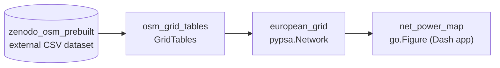

# Copper Sushi 2 — optimal power flow on the 2025 grid, constrained by measurements

The in-place successor of [v1](copper-sushi-app.md). v1 visualized a *model's* optimal power flow on the 2013 GridKit grid ("the math is real, the data is not"). Sushi 2 keeps the OPF and makes the data as real as it can be: **a 2024 day on the 2025 OSM-based grid, with measured generation fixed wherever it is measured and the optimiser filling only what is not.**

## Architecture (settled 2026-09-02; supersedes the 2026-08-19 measured-injections design)

1. **Grid**: PyPSA-Eur's OSM-based European network (Xiong et al., *Nature Scientific Data* 2025), built by PyPSA-Eur's own `base_network`.
2. **Workflow**: today's PyPSA-Eur, run from the [fork](https://github.com/zoltanmaric/pypsa-eur) on branch `coppersushi-opf` with a committed config, HiGHS as solver. Load disaggregation, plant matching and renewable profiles are upstream's (JRC Energy Atlas, powerplantmatching, atlite).
3. **Measurements in**: ENTSO-E zonal per-type actuals calibrate renewable availability; per-unit actuals (≥ 100 MW, geolocated via JRC-PPDB-OPEN + Global Energy Monitor) are fixed as constraints, HVDC flows pinned to actuals. See [nodal-disaggregation](nodal-disaggregation.md) for what is and is not measurable.
4. **Signal**: v1's family unchanged — net power per node, loaded-vs-easy branches, direction arrows, per-node tooltips.
5. **Web tool**: this repo, the viewer of the solved network; `Scattermapbox` pinned ([codebase-v1](codebase-v1.md)).

Why the pivot: load has no sub-zonal measurement anywhere, so "measured injections" were always going to be zonal measurements spread by static keys, and the cross-border check could not separate load errors from generation errors. Full rationale in [specs/sushi-2.md](specs/sushi-2.md).

## Implemented dataflow

This graph shows landed Sushi 2 production paths, not planned topology. The OSM grid assembly path becomes redundant once the fork produces solved networks and is deleted after Sep 11. Node IDs are stable domain-artifact identities; each arrow means “required to produce.” PRs update it only when implementation changes the topology.

External I/O belongs in `pipeline/sources/` or `pipeline/sinks/`; transformations exchange in-memory values. The architecture test checks a finite set of direct I/O APIs and deliberately does not claim to detect dynamic or transitive I/O.

## Deliberately out (this phase)

Flow-traced nodal carbon intensity (first future chapter); OPF counterfactual mode; JAO CNEC/flow-based-domain modeling (spot-check validation only); forecasting; article copy; hosting (trivial, decided at the end).

Validation is exploratory: computed flows vs ENTSO-E measured cross-border flows, FR–DE as the falsifiable AC comparison, ES–FR as the narrated case study, boring + eventful days mixed; discrepancies investigated and calibrations reported individually and honestly.

Working state: [specs/sushi-2.md](specs/sushi-2.md).
