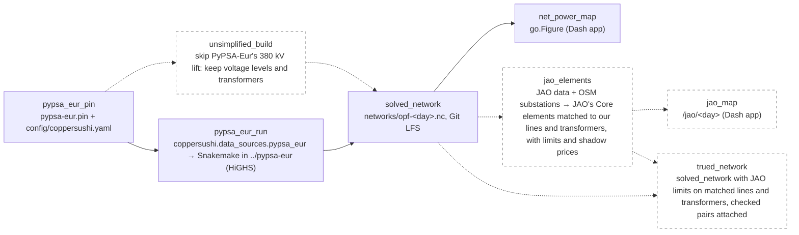

# Copper Sushi 2 — optimal power flow on the 2025 grid

The in-place successor of [v1](copper-sushi-app.md). v1 visualized a *model's* optimal power flow on the 2013 GridKit grid ("the math is real, the data is not"). Sushi 2 keeps the OPF and moves it to **PyPSA-Eur as of 2026, on the 2025 OSM-based grid, for a 2024 day** — a working OPF first; truing it up to measured data comes after.

## Architecture (settled 2026-09-02)

1. **Grid**: PyPSA-Eur's OSM-based European network (Xiong et al., *Nature Scientific Data* 2025), built by PyPSA-Eur's own `base_network`.
2. **Workflow**: PyPSA-Eur as of 2026, run from a [pinned sibling checkout](pypsa-eur-sibling.md) with a config committed here, HiGHS as solver. Load disaggregation, plant matching and renewable profiles are upstream's (JRC Energy Atlas, powerplantmatching, atlite).
3. **Signal**: v1's family unchanged — net power per node, loaded-vs-easy branches, direction arrows, per-node tooltips.
4. **Web tool**: this repo, the viewer of the solved network; `Scattermapbox` pinned ([codebase-v1](codebase-v1.md)).

## Dataflow

Solid nodes and edges are implemented; **dashed (class `planned`) are planned** and turn solid in the PR that lands them. Node IDs are stable domain-artifact identities; each arrow means "required to produce." PyPSA-Eur's internal rule chain is upstream's topology and is drawn on [pypsa-eur-sibling](pypsa-eur-sibling.md), not here.

Code is one package, `coppersushi/`, organised by domain noun; `io-boundary` in `coppersushi/AGENTS.md` names the two modules that touch the world.

## Future chapters

True-up to actuals — renewable dispatch calibrated to zonal actuals, units ≥ 100 MW fixed to measured output, validation against measured cross-border flows ([nodal-disaggregation](nodal-disaggregation.md) for what is and is not measurable). Then flow-traced nodal carbon intensity, OPF counterfactuals, hosting. Working state: [specs/sushi-2.md](specs/sushi-2.md).
