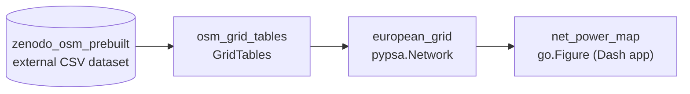

# Copper Sushi 2 — nodal flows from actual data

The in-place successor of [v1](copper-sushi-app.md). v1 visualized a *model's* optimal power flow on the 2013 GridKit grid ("the math is real, the data is not"). Sushi 2 inverts the caveat: **measured injections through grid physics on the 2025 OSM-based grid — the data is real too**. No optimization of dispatch, no predictions: with injections set, flows are determined.

## Architecture (settled 2026-08-19)

1. **Grid**: PyPSA-Eur's prebuilt OSM-based European network (Xiong et al., *Nature Scientific Data* 2025, Tom Brown's group).
2. **Injections** (revised 2026-09-02, [survey](nodal-disaggregation.md)): ENTSO-E Actual Generation per Generating Unit (≥100 MW, via `entsoe-py`) geolocated through JRC-PPDB-OPEN + Global Energy Monitor (ENTSO-E units carry no coordinates; `powerplantmatching` cannot supply them); sub-100 MW remainder = zonal totals per type minus per-unit actuals, allocated over geolocated registries (MaStR, osm-powerplants, GEM), or over measured sub-national feed-in where it exists; load = zonal actuals split by the JRC Energy Atlas 1 km consumption raster (PyPSA-Eur's own replacement for the NUTS3 GDP/population split).
3. **Physics**: linear power flow (`network.lpf()`) for AC; HVDC link flows are *pinned to measured values* (lpf doesn't solve them — stated openly, so physics is genuinely tested only on AC corridors). Estimated splits reconciled to zonal totals by proportional rescaling.
4. **Signal**: v1's family unchanged — net power per node, loaded-vs-easy branches, direction arrows, per-node tooltips — driven by actuals.
5. **Web tool**: Python core; viz stack deliberately open (pipeline first, viz decided from remaining time).

## Implemented dataflow

This graph shows landed Sushi 2 production paths, not planned topology. Node IDs are stable domain-artifact identities; each arrow means “required to produce.” PRs update it only when implementation changes the topology.

External I/O belongs in `pipeline/sources/` or `pipeline/sinks/`; transformations exchange in-memory values. The architecture test checks a finite set of direct I/O APIs and deliberately does not claim to detect dynamic or transitive I/O.

## Deliberately out (this phase)

Flow-traced nodal carbon intensity (first future chapter); OPF counterfactual mode; JAO CNEC/flow-based-domain modeling (spot-check validation only); forecasting; article copy; hosting (trivial, decided at the end).

Validation is exploratory: computed flows vs ENTSO-E measured cross-border flows, FR–DE as the falsifiable AC comparison, ES–FR as the narrated case study, boring + eventful days mixed; discrepancies investigated and calibrations reported individually and honestly.

Working state: [specs/sushi-2.md](specs/sushi-2.md).
